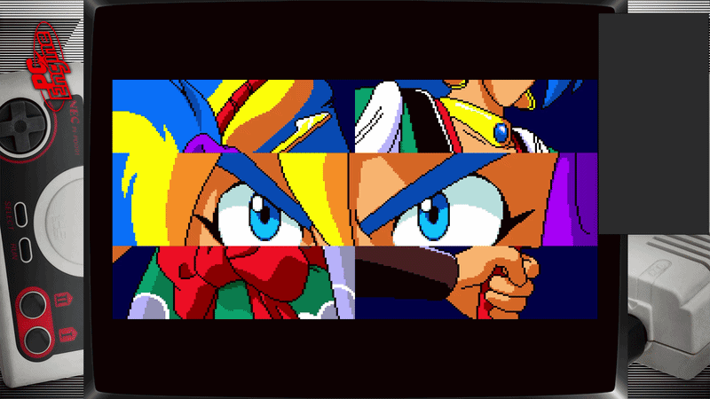
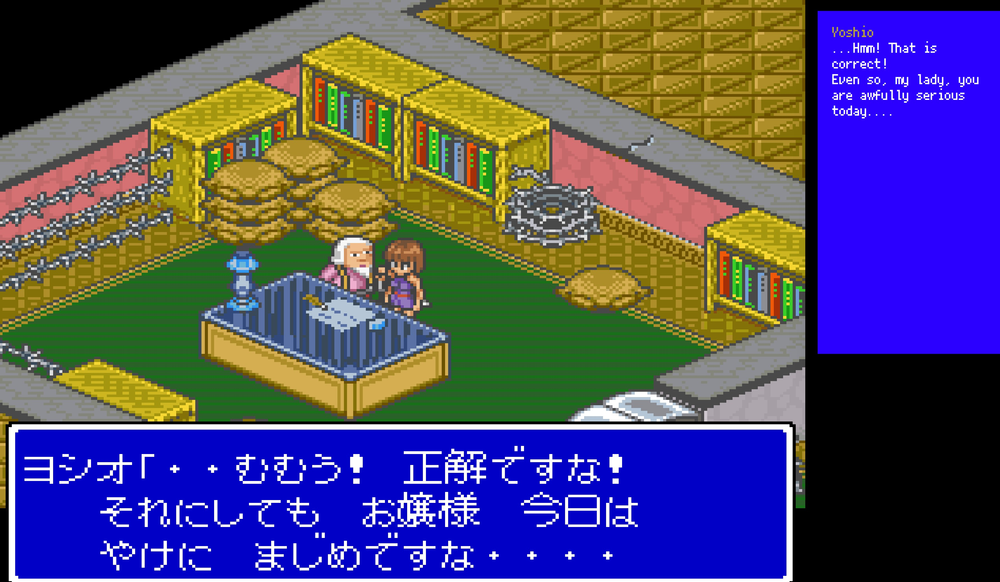
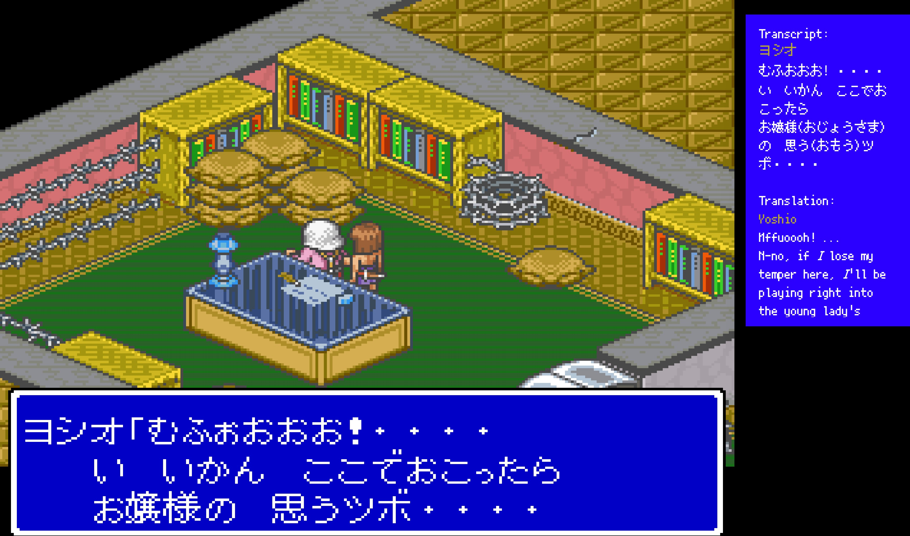
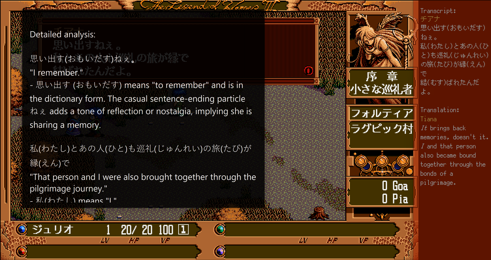
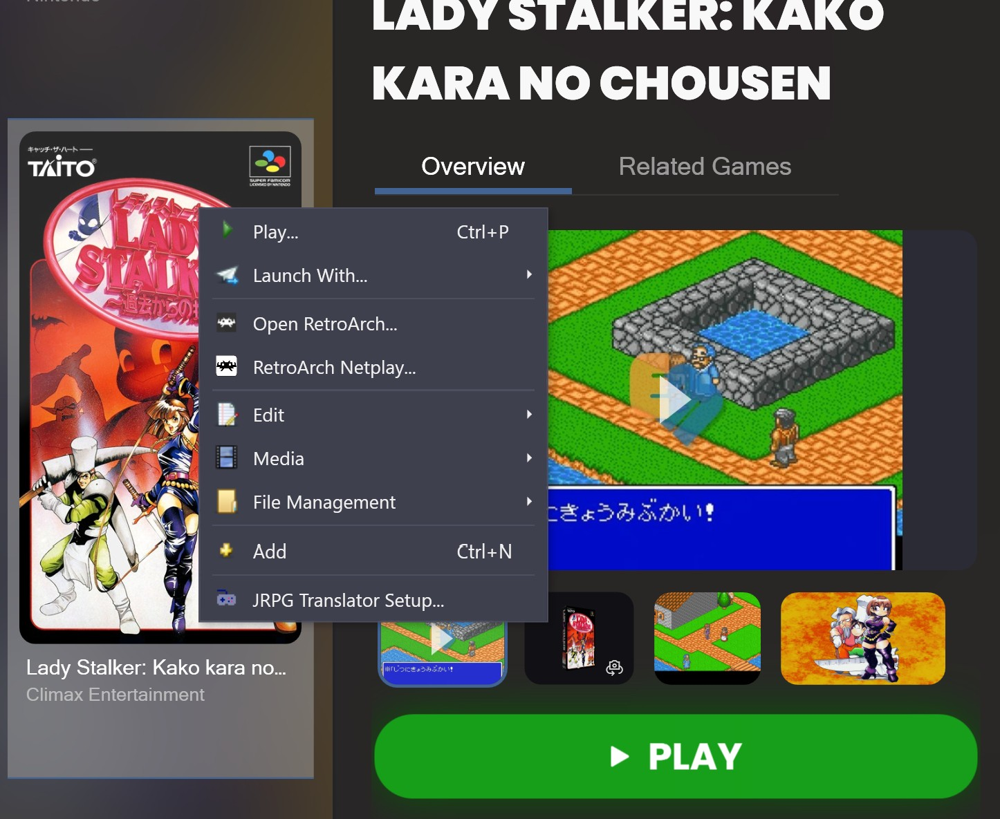
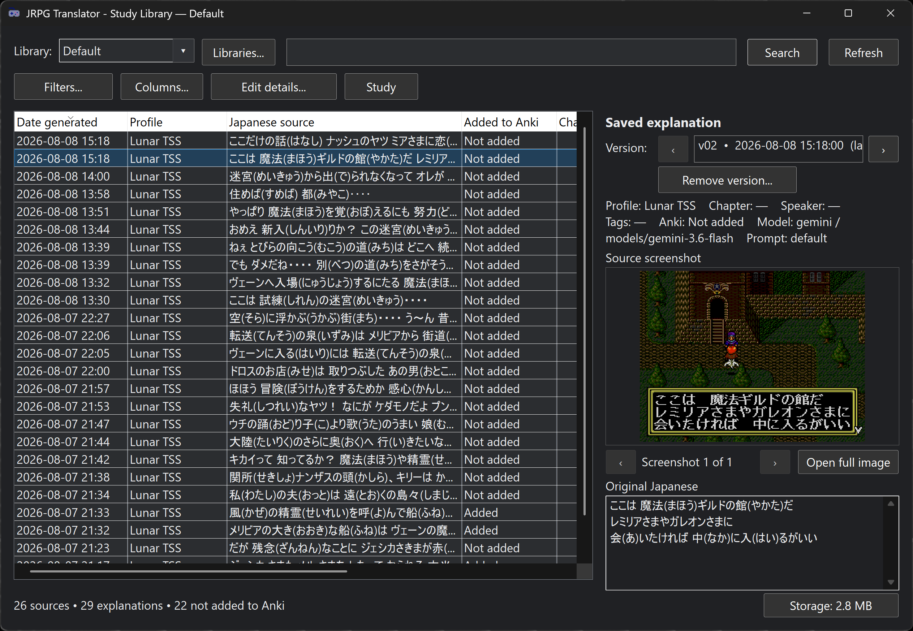
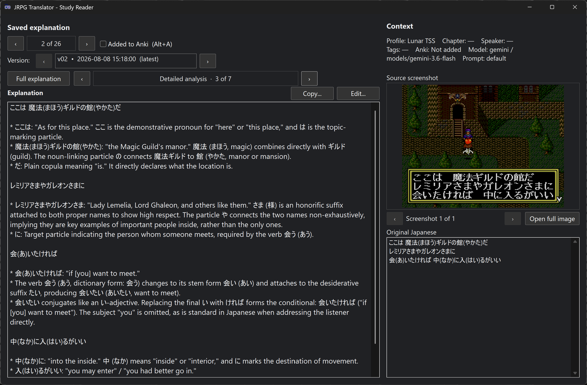
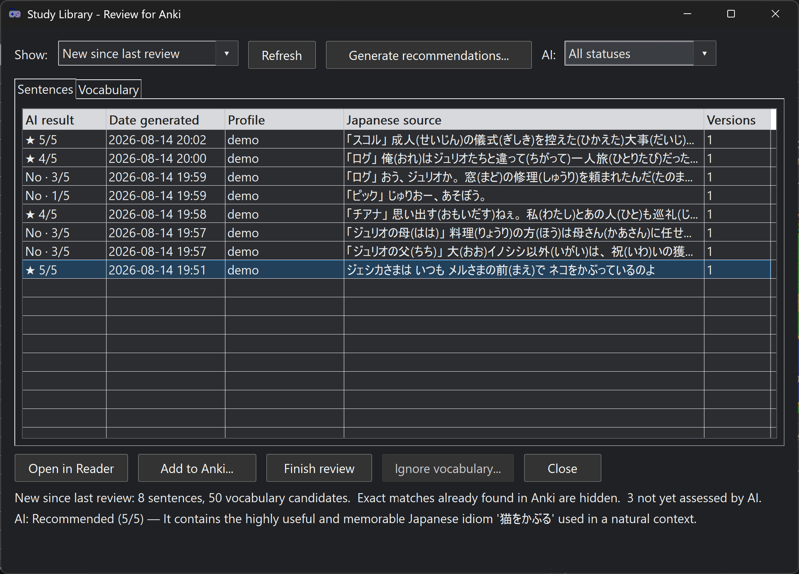
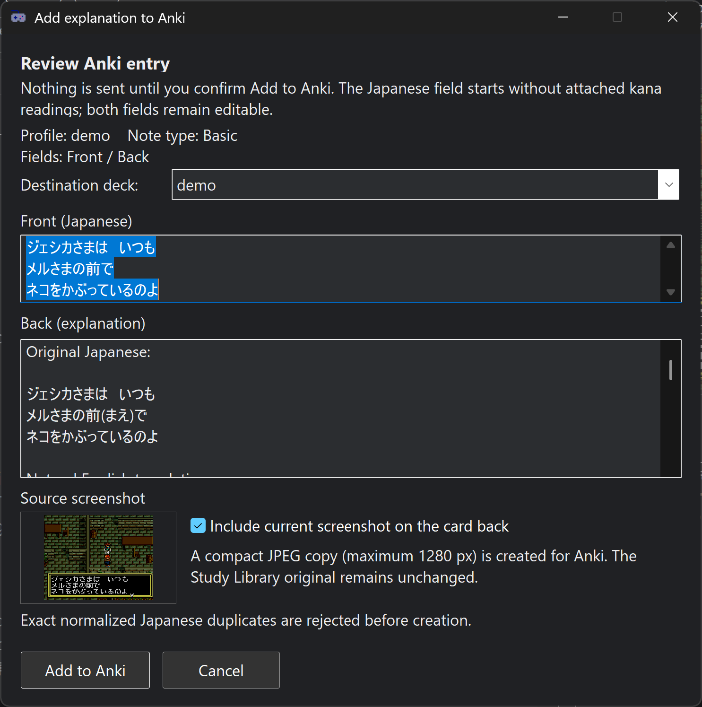

# JRPG Translator Toolkit

JRPG Translator is a Windows toolkit for translating Japanese games while you
play. It combines screenshot translation, direct live-audio translation, and a
separate Japanese-learning explainer with customizable overlay windows.

The control panel works with a mouse and keyboard or directly from an
XInput-compatible controller. Keyboard mapping tools such as JoyToKey, Steam
Input, or DS4Windows remain optional for custom and multi-function mappings.

## See It in Action

### Live Audio Translation

Translated dialogue appears in the overlay while a voiced cutscene is playing.

<p align="center">
  <a href="docs/media/live-audio-translation.gif">
    
  </a>
</p>

### Screenshot Translation Modes

Choose a compact translation-only overlay or include the Japanese transcript
and kanji readings for language study. Click either image to view it at full
size.

<table>
  <tr>
    <th width="50%">Translation only</th>
    <th width="50%">Transcript, kanji readings, and translation</th>
  </tr>
  <tr>
    <td>
      <a href="docs/media/screenshot-translation.jpg">
        
      </a>
    </td>
    <td>
      <a href="docs/media/transcript-kanji-readings.jpg">
        
      </a>
    </td>
  </tr>
</table>

### Explanations and Frontend Integration

The separate Explainer can break down vocabulary, readings, grammar, and nuance.
The optional LaunchBox / Big Box plugin prepares the selected JRPG Translator
Profile automatically for each game.

<table>
  <tr>
    <th width="50%">Japanese-learning explanation</th>
    <th width="50%">LaunchBox / Big Box integration</th>
  </tr>
  <tr>
    <td>
      <a href="docs/media/japanese-explainer.png">
        
      </a>
    </td>
    <td>
      <a href="docs/media/launchbox-integration.jpg">
        
      </a>
    </td>
  </tr>
</table>

### Study Library and Reader

Save explanations together with their Japanese source and optional screenshots,
organize them with searchable metadata, and revisit them in a focused reading
view. Click either image to view it at full size.

<table>
  <tr>
    <th width="50%">Study Library</th>
    <th width="50%">Study Reader</th>
  </tr>
  <tr>
    <td>
      <a href="docs/media/study-library.png">
        
      </a>
    </td>
    <td>
      <a href="docs/media/study-reader.png">
        
      </a>
    </td>
  </tr>
</table>

Review saved sentences and vocabulary after playing, optionally ask the selected
AI model to rank useful study candidates, and send chosen material to Anki after
checking the editable card preview.

<table>
  <tr>
    <th width="50%">Review for Anki</th>
    <th width="50%">Add explanation to Anki</th>
  </tr>
  <tr>
    <td>
      <a href="docs/media/review-for-anki-v095.png">
        
      </a>
    </td>
    <td>
      <a href="docs/media/add-explanation-to-anki-v095.png">
        
      </a>
    </td>
  </tr>
</table>

## Features

- Screenshot translation with OpenAI and Google Gemini vision models.
- Near-live audio translation using OpenAI Realtime Translate or Gemini Live
  Translate models, without a separate transcription step.
- A dedicated Explainer for vocabulary, kanji readings, grammar, literal
  meaning, natural translations, nuance, and cultural context.
- A searchable Study Library and focused Study Reader with optional source
  screenshots, metadata, version history, editing, copying, and Anki status.
- Optional automatic saving of plain-text explanation copies for later study.
- Independent Translator and Explainer overlays with configurable colors,
  fonts, borders, transparency, position, and size.
- Translation and explanation prompts editable from the control panel.
- Unified Profiles that store prompt selections, capture target, terminology
  settings, D-pad navigation, startup choices, and both overlays' appearance,
  position, and size.
- Independent model lists for screenshot translation, live audio, and
  explanations, with API-backed model discovery and manual model-ID entry.
- Selectable output language for live audio translation.
- JP-to-target-language and target-language-to-target-language glossary profiles
  for consistent names, terminology, spelling, and preferred wording, with an
  immediate per-Profile on/off switch.
- Configurable keyboard hotkeys, optional direct controller action bindings,
  optional D-pad navigation, and spatial controller focus movement.
- A resizable control panel with compact scrolling, dark mode, whole-window
  opacity, and magnetic preferred width and height points.
- Non-activating overlays that can remain visible without taking focus from the
  game or pausing an emulator.
- Optional per-game LaunchBox / Big Box integration with JRPG Translator
  Profile selection and independent JoyToKey profile switching.

## Requirements

- Windows 10 or Windows 11.
- An OpenAI API key, a Gemini API key, or both.
- Internet access for translation and explanation requests.

The downloadable release includes a portable Python environment and compiled
AutoHotkey executables. A separate Python or AutoHotkey installation is not
needed when using the release package.

## Quick Start

1. Download and extract the
   [latest release](https://github.com/retrogamer0815/jrpg-translator-toolkit/releases/latest).
2. Run `JRPG Translator.exe`.
3. Add your API keys in the **API Keys** tab, or set `OPENAI_API_KEY` and/or
   `GEMINI_API_KEY` as Windows user environment variables.
4. Open the Translator overlay.
5. In **Screenshot Translation**, choose **Capture...**, then select a region or
   game window.
6. Select the provider, model, prompt, and hotkeys you want to use.

Most control-panel settings save immediately. Manually edited application paths
and **Debug mode** are saved with **Save paths** in the optional **Paths** tab.
API keys stored in `Settings/.env` use **Save Keys** in **API Keys**; prompt and
terminology editors have their own Save controls.

## Translation Workflows

### Screenshot Translation

Use **Screenshot + Translate** for the fastest one-button workflow. You can also
take one or more screenshots first and translate them together, which is useful
when a sentence spans multiple dialogue boxes.

The screenshot prompt controls the requested output, so it can include a plain
translation, the original Japanese, kanji readings, speaker names, or any other
format useful for playing or studying.

### Live Audio Translation

In the **Audio Translation** tab:

1. Select the Windows playback device.
2. Optionally choose **Test Audio** while sound is playing to verify that the
   selected device is receiving audible output. This test is local and does not
   make an API request.
3. Choose OpenAI or Gemini and a compatible live translation model.
4. Select the output language.
5. Choose **Audio Translation Off** in the footer to start translation. The
   button changes to **Audio Translation On** while the live session is active;
   choose it again to stop.

Audio is streamed directly to the selected live translation model. Translated
lines appear at the bottom of the Translator overlay while older lines move
upward and remain available for scrolling.

### Japanese Explainer

The Explainer uses the most recent Japanese screenshot text. Choose
**Explain last jp. Text** or its configured hotkey to generate a separate
learning-focused explanation without replacing the translation.

Explanation prompts are independent from translation prompts, so they can be
tuned for a learner's level and preferred amount of detail.

### Study Library and Reader

Enable **Save explanations to Study Library** to keep the Japanese source,
explanation, Profile, provider/model details, and optional source screenshots in
a local searchable database. Repeated explanations of the same Japanese text
are grouped as versions rather than becoming unrelated entries.

**Open Study Library...** provides filters for Profile, chapter, speaker, tags,
date/time, and Anki status, plus bulk metadata editing and configurable columns.
Its **Study** action opens a reading-focused view with the explanation, parsed
section navigation, screenshots, and original Japanese. Explanations can be
edited safely or copied—including an option that removes attached hiragana
readings from the Japanese text before it is pasted into an Anki card.

Multiple named Study Libraries can be created and selected through unified
Profiles. Optional **Save plain-text copies** continues to use
`Settings/Explanations`, sorted into a subfolder for the active Profile.

### Terminology Overrides

The **Terminology Overrides** tab provides separate JP-to-target-language and
target-language-to-target-language glossary Profiles. **Use terminology
overrides** enables or disables both stages immediately for screenshot
translation, live audio translation, and explanations.

When the option is off, JP-to-target-language entries are not sent to a model
and local target-language replacements are skipped. The enabled state and both
selected glossary Profiles are stored in unified Profiles, including Profiles
applied through LaunchBox / Big Box.

Each glossary type has an independent profile list. **Manage Entries...** opens
a two-column table where mappings can be added, edited, or deleted without
manually maintaining `source -> replacement` lines. TL -> TL entries are applied
locally to correct model output; JP -> TL entries are additional instructions
sent to the selected model.

## Controller Use

The control panel supports an XInput-compatible controller without a keyboard
mapper:

- The D-pad moves spatially between visible controls and tabs.
- A / Cross confirms; B / Circle cancels or closes dialogs and text editors.
- **Use D-pad for control panel navigation** can be turned off when JoyToKey,
  Steam Input, DS4Windows, or another mapper already sends arrow keys. A / Cross
  and B / Circle remain available.
- The **Controls** tab can optionally bind actions such as Screenshot +
  Translate, Explain, and overlay visibility directly to controller buttons.
- Keyboard hotkeys remain available and can still be mapped through JoyToKey or
  another controller mapper for custom, long-press, and multi-function layouts.
- Font size, Max PNG size, transparency, font weight, and overlay colors can be
  adjusted without a mouse. The controller color editor provides live hue,
  saturation, and brightness previews.
- Mouse-wheel or arrow-key mappings can scroll the visible Translator or
  Explainer overlay even when it does not own game focus.

The overlays can be brought forward without becoming the active window. This
allows emulator options such as RetroArch's pause-when-inactive behavior to
remain enabled while translations are visible. Opening the control panel still
activates it normally.

The Translation Window and Explanation Window tabs also include a
`Move / Resize` mode. With an XInput-compatible controller, the left stick moves
the selected overlay and the right stick resizes it. Arrow keys provide a
fallback; hold the configured Screenshot + Translate key while pressing arrows
to resize. Enter saves the new bounds and Escape restores the previous bounds.

Capture targets can also be configured without a mouse. **Capture > Region**
reuses the analog-stick move and resize controls, while **Capture > Window**
cycles through available windows and previews the selected target. A / Cross
saves and B / Circle cancels either mode. Opening Region mode with a mouse keeps
the conventional drag-to-select workflow.

## LaunchBox / Big Box Integration

A preview plugin is included as source under `integrations/launchbox`. It adds
`JRPG Translator Setup...` to each game's LaunchBox context menu and Big Box
details menu. Per game, it can:

- start JRPG Translator in background mode and close only the instance it
  started;
- apply a selected JRPG Translator Profile for the game;
- start JoyToKey or switch an existing instance to a selected profile; and
- restore the previous JoyToKey profile when the game exits.

If JRPG Translator is already running, the plugin applies the selected Profile
without restarting it and leaves the pre-existing instance open when the game
exits.

The plugin setup window can browse for the Translator executable, JoyToKey
executable, and JoyToKey profile folder. Big Box uses a controller-native path
browser, while LaunchBox retains the standard Windows file and folder pickers.
The setup window also provides **Open JRPG Translator...** for first-time API,
hotkey, capture, and overlay configuration before using background launches.
See
[`integrations/launchbox/README.md`](integrations/launchbox/README.md) for build,
packaging, and installation instructions.

## API Keys and Privacy

The recommended key-storage method is Windows user environment variables:

```text
OPENAI_API_KEY=your_key
GEMINI_API_KEY=your_key
```

The control panel can alternatively store keys in `Settings/.env`. This is a
plain-text file: do not commit it, upload it, or include it in shared archives.

The **API Keys** tab can open Windows Environment Variables directly. If a
selected provider has no configured key, the relevant overlay identifies the
missing OpenAI or Gemini key instead of leaving a loading indicator active.

Screenshots and audio sent for translation are processed by the selected API
provider. Review the provider's current data and privacy terms before use.

## Settings and Profiles

Portable settings live in the local `Settings` folder:

```text
Settings/
|-- control.ini
|-- .env                         # optional local API-key storage
|-- Screenshots/
|-- Explanations/                # optional saved study material
|-- prompts/                     # screenshot translation prompts
|-- prompts_explain/             # explanation prompts
|-- glossaries/
`-- game_profiles/               # unified Profiles
```

A unified Profile stores the selected screenshot and explanation prompts,
capture region or window, guessed-subject highlighting, speaker-name coloring,
terminology selections and enabled state, D-pad navigation, overlay startup and
topmost choices, and both overlays' position, size, colors, transparency, font,
font size, and weight. Translator and Explainer appearance settings remain
independent inside each Profile. Screenshot output handling is selected
automatically from the prompt name and is no longer a normal user-facing
selector.

The source repository and release include three prompt families for every
supported output language:

| Prompt pattern | Purpose |
| --- | --- |
| `Settings/prompts/default_<language>.txt` | Screenshot translation with a plain Japanese transcript |
| `Settings/prompts/default_with_kanji_reading_<language>.txt` | Screenshot translation with hiragana readings added to kanji words |
| `Settings/prompts_explain/default_<language>.txt` | Japanese-learning explanation in the selected language |

Available language labels are `en`, `de`, `fr`, `es`, `it`, `pt`, `nl`, `pl`,
`ru`, `uk`, `ko`, `zh-CN`, `zh-TW`, and `ja`. The screenshot prompts retain the
literal `Transcript:` and `Translation:` headings because the output parser uses
them; the translated content follows the language requested by the selected
prompt. When several screenshots are submitted together, the bundled prompts
instruct the model to reconstruct the passage in capture order before
translating it.

Additional prompt profiles created through the control panel remain local and
are ignored by Git.

## Project Structure

| File | Purpose |
| --- | --- |
| `JRPG Translator.ahk` | Main control panel and workflow orchestration |
| `bin/overlay.ahk` | Translator and Explainer overlay windows |
| `bin/overlay.exe` | Compiled overlay included in release packages, not the source repository |
| `scripts/screenshot_translator.py` | Screenshot vision translation and output formatting |
| `scripts/live_audio_translator.py` | Direct streaming audio translation |
| `scripts/explainer.py` | Japanese-learning explanations |
| `scripts/model_catalog.py` | Provider model discovery, filtering, sorting, and caching |
| `integrations/launchbox/` | Optional per-game LaunchBox / Big Box and JoyToKey integration |
| `docs/media/` | Curated screenshots and animation displayed in this README |

Runtime messages and generated overlay text are exchanged through
`%TEMP%\JRPG_Overlay`.

## Running from Source

Install AutoHotkey v2 and run `JRPG Translator.ahk`. The source version launches
`bin/overlay.ahk`; compiled releases launch `bin/overlay.exe`.
The Python scripts require Python 3.12 and their listed dependencies, or the
portable Python environment included in a release package.

```powershell
py -3.12 -m pip install -r requirements.txt
```

Before sharing a build, verify that it does not contain `Settings/.env`, API
credentials, personal Profiles, `Settings/Screenshots`, saved explanations,
logs, or other local state. The curated showcase files under `docs/media` are
intentional repository assets.

## Troubleshooting

- If an overlay reports a missing API key, add it through **API Keys** or set the
  provider's Windows user environment variable and restart JRPG Translator.
- If a request fails, verify the selected model name and confirm that the API
  key has access to that model.
- If the wrong playback source is translated, refresh and reselect the device
  in **Audio Translation**, then use **Test Audio** while sound is playing.
- If an overlay is missing, use the Open Translator or Open Explainer button and
  check its saved position on connected displays.
- If source files do not start, confirm that AutoHotkey v2 is being used rather
  than AutoHotkey v1.

## Credits

- [AutoHotkey](https://www.autohotkey.com/): GNU GPLv2.
- [Python](https://www.python.org/): PSF License.
- [PixelMplus](https://itouhiro.github.io/mplus-fonts/): SIL Open Font License
  1.1.
- Application icon by Miguel C Balandrano via Flaticon; attribution is required
  by the source license.

## License

The project source is released under the MIT License. See [LICENSE](LICENSE).
