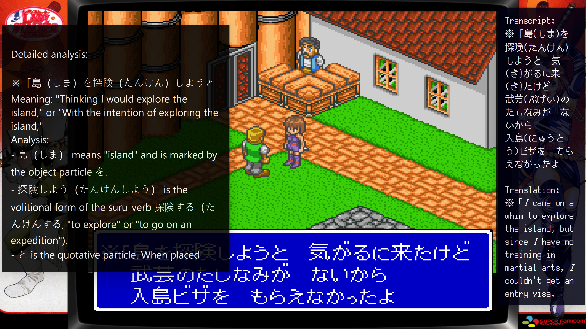

# 1. Introduction and key concepts

[Manual contents](README.md) · [Next: Setup →](02-setup.md)

## What JRPG Translator does

JRPG Translator is a Windows companion for playing Japanese games. It does not patch the game or replace its original dialogue. Instead, it reads a chosen part of the screen or listens to the selected audio output and displays results in overlay windows.

There are three independent AI functions:

| Function | Input | Result |
| --- | --- | --- |
| Game Text Translation | Screenshots of a selected region or window | A translation, optionally with Japanese text and readings, depending on the prompt |
| Audio Translation | Sound from a selected Windows playback/output device | Live translated dialogue in the Translator overlay |
| Explanation | The latest Japanese source from Game Text Translation | A learning-oriented explanation in the Explainer overlay |

Translation can be used on its own. The Explainer, Study Library, recommendations, and Anki integration are optional.

*Figure S01. A playing session with the original game dialogue, a Japanese transcript and translation on the right, and a learning explanation on the left.*

## A typical playing session

1. Start the game and JRPG Translator, or let the LaunchBox plugin prepare them.
2. Apply a saved game Profile if you have one.
3. Choose the dialogue region or game window.
4. Use **Capture & Translate** when new dialogue appears.
5. Optionally ask the Explainer about the latest Japanese text.
6. Continue playing; review saved explanations in the Study Library afterward.

For voiced scenes, you can also start Audio Translation. Image and audio translation have separate AI selections, even though their results use the Translator overlay.

## Desktop, overlays, and full-screen mode

The **desktop interface** is the main place to configure the application. It provides pages for translation, audio, explanations, overlay appearance, Profiles, and Settings.

The **Translator** and **Explainer** are output windows placed over or beside the game. Showing an overlay is different from opening the main control panel. Overlay appearance can be adjusted independently.

The **full-screen dashboard** is intended for controller use, particularly in Big Box. It provides large tiles, page navigation, and a game/session header. It is not a separate set of configuration files.

The **Study Library** opens in its own window so that reading and organizing material does not crowd the game controls.

## Names that are easy to confuse

| Term | Meaning |
| --- | --- |
| Provider | The AI service, such as OpenAI or Google Gemini |
| Model | A particular model offered by that provider |
| Prompt | Instructions telling the model what kind of translation or explanation to produce |
| JRPG Translator Profile | A saved selection of game-related settings, including capture and overlay settings |
| Glossary profile | A named set of terminology rules; selected separately for the two rule types |
| JoyToKey profile | A controller-to-keyboard mapping managed by JoyToKey |
| Study Library | A separate collection of saved explanations, metadata, and screenshots |
| Anki deck / note type | Anki's destination and field/template structure for flashcards |

A Profile can remember a selected Library or glossary profile, but it does not contain a complete copy of those libraries or glossary files.

## Limits and privacy

AI output can misread characters, invent a subject, miss context, or explain a sentence incorrectly. Treat it as assistance rather than an authoritative translation or grammar reference. Compare uncertain results with the source, surrounding dialogue, or another reference.

Image translation sends the selected image content to the chosen provider. Audio translation sends audio from the selected playback device. Explanations and AI-assisted study operations send the text needed for those requests. Avoid capturing passwords, private messages, or unrelated desktop content.

You control whether explanations and screenshots are saved locally. Local storage and sending input to an AI provider are separate choices: disabling Study Library saving does not make an AI request local-only.

JRPG Translator works without LaunchBox. The optional plugin is useful for automatically choosing settings and tools per game; it is not required for manual use.
