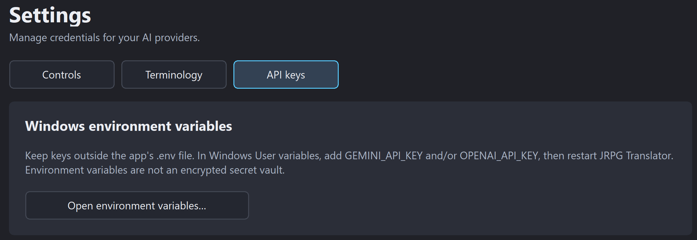
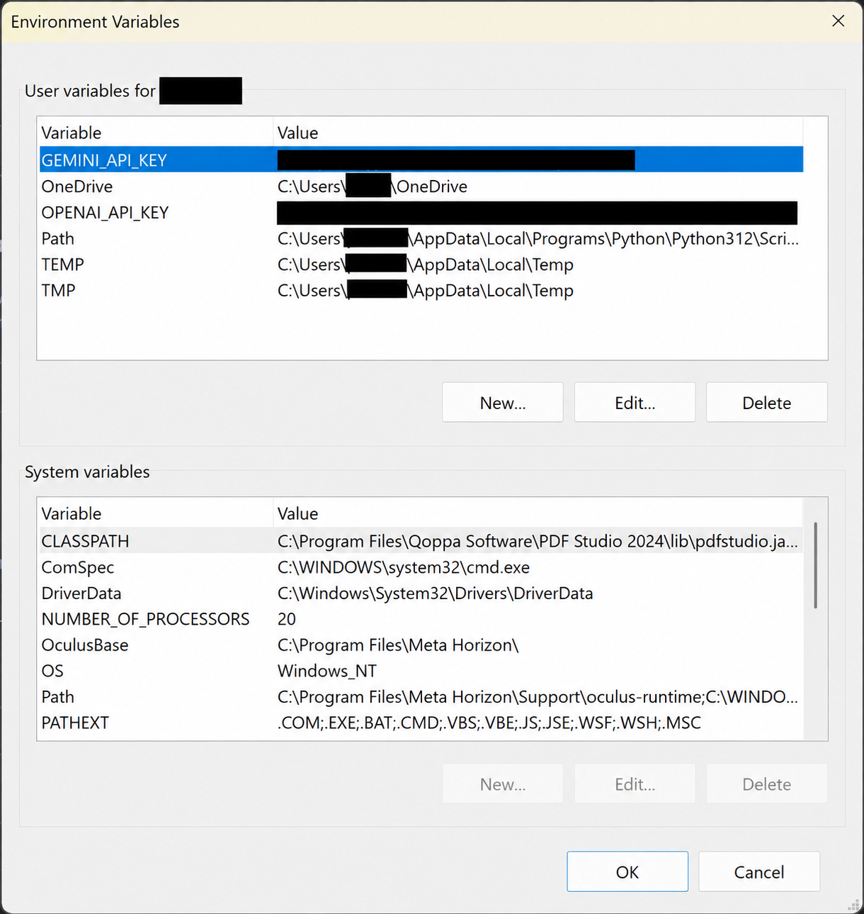

# 2. Download, setup, and your first translation

[← Introduction](01-introduction.md) · [Contents](README.md) · [Next: Interface and controllers →](03-interface-and-controller.md)

## Before you begin

Use Windows 10 or 11 and a packaged release of JRPG Translator. You will also need an internet connection and API access to a supported provider for the AI functions you want to use.

The packaged application is portable: extract it into a writable folder and keep its supporting files together. A full packaged build includes the runtime components needed by the tool; you should not need to install Python or AutoHotkey separately for ordinary use. The GitHub source-code ZIP is not the same thing as a ready-to-run release.

You have two choices for API-key storage: keep keys with your Windows user account (recommended for a single-machine setup), or save them in the app folder for convenience when moving between your own machines, for example on a USB stick. Both methods are explained below; in-app storage is optional.

LaunchBox, Big Box, JoyToKey, and Anki are optional, separate applications.

## Download and extract

1. Open the [GitHub releases page](https://github.com/retrogamer0815/jrpg-translator-toolkit/releases).
2. Read the release notes and choose the packaged build you intend to use. A testing build may be listed separately from the latest stable release.
3. Extract the complete archive. Do not run the executable from inside the ZIP.
4. Place it somewhere your Windows account can write, such as a dedicated games/tools folder. Avoid a protected installation folder if you do not intend to manage its permissions.
5. Start **JRPG Translator.exe**.

Do not move only the executable: scripts, overlay components, Python, and settings are part of the application layout. If Windows blocks a downloaded archive or file, verify that it came from the expected repository before using Windows' unblock option. Do not disable system-wide security protection to run the tool.

*Figure S02. Keep the complete extracted folder together. Start JRPG Translator.exe for the main application.*

## Obtain an API key

The application uses provider APIs, not a provider's ordinary chat website. Create an API key in your own account and check the API project's billing, limits, and model access before sending requests.

### Google Gemini

Create or manage a key in [Google AI Studio](https://aistudio.google.com/app/apikey). Google's [API-key guide](https://ai.google.dev/gemini-api/docs/api-key) explains the project/key setup, and its [billing guide](https://ai.google.dev/gemini-api/docs/billing) explains account tiers and billing.

At the time of writing Google offers a free tier API key which allow you to use the recommended Flash and Flash-Lite models, the number of requests is not unlimited but might be enough for playing a few hours every day and testing this application.

### OpenAI

Use the [OpenAI API quickstart](https://developers.openai.com/api/docs/quickstart) and [API keys dashboard](https://platform.openai.com/api-keys). Consult [current API pricing](https://developers.openai.com/api/docs/pricing) for costs. Do not assume a chat-product subscription supplies API credits.

Model availability, quotas, pricing, and regional access can change. This manual deliberately does not promise a particular model or free allowance.

### Keep keys private

An API key is a credential. Do not include it in screenshots, exported support files, public GitHub issues, or a shared portable folder. If one is exposed, revoke it in the provider dashboard and create a replacement.

## Choose where to store API keys

Open **Settings → API keys** and choose the method that fits how you use the app. You only need a key for each provider you plan to use.

- **Windows user environment variables — recommended on one machine.** Keys stay with your Windows account on that PC, outside the application folder. This reduces the risk of accidentally including them when copying or sharing the app folder. Configure them separately on each PC/account you use.
- **In-app storage — convenient for portability.** Keys are saved in `Settings\.env` and travel with the complete app folder, including on a USB stick. Anyone who can read that file can read the keys, so keep the drive, folder, and its backups private.

Neither option is an encrypted secret vault. Windows environment variables are also stored without encryption and can be exposed if the account, machine, or process is compromised. The recommendation above is about keeping credentials out of copied application files, not making them inaccessible to other software. See [Microsoft's environment-variable security warning](https://learn.microsoft.com/en-us/aspnet/core/security/app-secrets#work-with-environment-variables).

### Option 1: Windows user environment variables

You do not need to find the Windows dialog yourself or use a terminal: JRPG Translator opens it directly.

*Figure S03b. Open environment variables takes you straight to the Windows dialog. You do not need to enable in-app key entry to use this option.*

1. Open **Settings → API keys**.
2. Select **Open environment variables...** in the **Windows environment variables** card.
3. In the upper **User variables** section, choose **New...**. If the variable already exists, select it and choose **Edit...** instead. Leave **System variables** and unrelated entries such as `Path` unchanged.
4. Enter the appropriate name in **Variable name** and paste only your API key into **Variable value**:

   - Gemini: `GEMINI_API_KEY`.
   - OpenAI: `OPENAI_API_KEY`.

5. Confirm with **OK**. Repeat for the other provider only if you use it, then choose **OK** in the Environment Variables dialog to save.
6. Fully close and restart JRPG Translator. If you launch it through LaunchBox / Big Box, restart that launcher first as well, so the new process inherits the updated variables.

*Figure S03c. Add your provider keys in the upper User variables section, not System variables. The black blocks are privacy redactions for this manual; Windows normally displays these values openly.*

The in-app key fields can remain empty with this method; you do not need to copy the keys into both places or choose **Save keys**. Gemini also accepts `GOOGLE_API_KEY` for compatibility, but `GEMINI_API_KEY` is the straightforward choice for this setup.

Windows retains user variables across restarts; running programs inherit their environment from the process that launched them. If a fresh app launch still uses old values, close its launcher or terminal too; signing out and back in can refresh the session. See [Microsoft's environment-variable documentation](https://learn.microsoft.com/en-us/powershell/module/microsoft.powershell.core/about/about_environment_variables).

### Option 2: In-app storage for a portable setup

Choose this if you want your keys to accompany the app between your own trusted machines without configuring Windows on each one.

1. Open **Settings → API keys**.
2. Enable **Enter API keys in JRPG Translator (.env)**.
3. Enter the key for each provider you plan to use.
4. Choose **Save keys**.
5. Check the displayed storage/status information.

*Figure S03a. Optional in-app key entry with both credentials masked. Save keys writes the local .env file; Delete .env is a separate action.*

In-app storage writes a local `Settings\.env` file. Keep that file with your private portable installation if you want the keys to travel with it. Do not include it in public uploads, support bundles, or app copies you give to someone else. Masking a field on screen does not encrypt the saved value.

### Switching methods or troubleshooting an old key

Turning off in-app key editing does **not** delete an existing `.env`. To move to Windows-only storage, configure the Windows user variables first, then use **Delete .env** to remove the saved in-app keys. If that button is disabled, enable in-app entry to access it; you do not need to save the keys again. This removes the app's `.env` file, not your Windows variables. Restart the app and its launcher before testing. Older backups or copied folders may still contain the old file.

An existing process environment variable is not overwritten by the same variable in `.env`. If an old key keeps being used, check both sources, including any Gemini compatibility alias. This also matters on a destination PC when using a USB copy: its Windows key may take precedence over the key carried with the app.

## Choose the translation AI

On **Game Text**:

1. Select a **Provider** for screenshot translation.
2. Select a compatible image-capable **Model**.
3. Select a **Prompt**. A bundled translation prompt is the simplest starting point.
4. If you want to use the Explainer later, choose a prompt that includes the Japanese transcript, such as a bundled `with_transcript` or `with_kanji_reading` prompt.

The providers and models for Explanation and Audio are configured separately. Selecting a model here does not configure all three functions.

Use **Manage models...** if your intended model is absent. Models must support the relevant API operation and be available to your account; appearing in a list is not a guarantee that your key can use one.

## Make your first translation

1. Start a game and display a stable dialogue line.
2. In **Game Text**, choose **Change capture...**.
3. Select a region around the dialogue, or select the game window.
4. Finish the selection. This sets the target; it does not capture or translate yet.
5. Choose **Capture & Translate**, or use its configured shortcut.
6. Wait for the result in the Translator overlay.
7. Adjust the overlay's position or appearance if it covers important game content.

For an initial test, a clearly readable, small dialogue region is easier to diagnose than a full desktop capture. Avoid cutting off the speaker name or part of a character.

*Figure S04. A first translation result: the original dialogue remains in the game, while the Translator displays its translation on the right.*

If nothing appears, check the capture target, provider key, selected model, and whether the Translator overlay is visible. See [Troubleshooting](12-troubleshooting-and-advanced.md).

## What is saved, and when?

Most ordinary settings take effect and persist as you change them. There are important exceptions:

- In-app API-key editing uses **Save keys**; Windows user variables are saved with **OK** in the Windows dialog and require restarting the app/launcher.
- Prompt, glossary, and other editors have their own save/confirm actions.
- A named **Profile** is a snapshot. Use **Save current** to update it; changing the live settings is not the same as rewriting that Profile.
- Startup overlay options control a future start/open sequence; they are not substitutes for the current show/hide controls.

Once the first translation works, create a Profile for the game. Add audio, study features, and LaunchBox integration afterward if you want them.

## Update an existing installation

1. Stop audio translation and close JRPG Translator and its overlays. Close LaunchBox / Big Box too if you are replacing the plugin.
2. Back up the complete **Settings** folder and any data stored in custom locations.
3. Read the new release's migration notes.
4. Prefer extracting the new package to a fresh folder, then migrating your settings according to those notes. This keeps the previous installation available for rollback.
5. Check keys, model selections, capture paths, Profiles, and a saved Study Library before resuming normal use.
6. Update the LaunchBox plugin separately if the release includes a new plugin package.

Do not overwrite your only backup with a newly migrated library. Database and settings formats may change between testing builds. A source-code checkout or a single new EXE should not be assumed to be a complete release upgrade.
