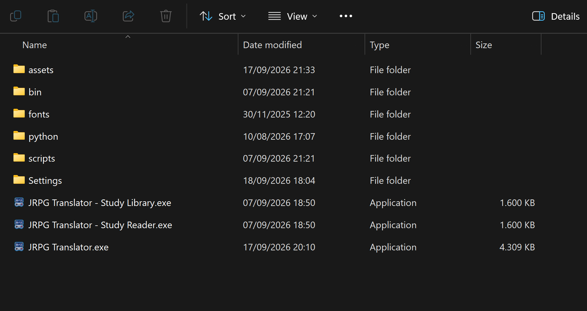
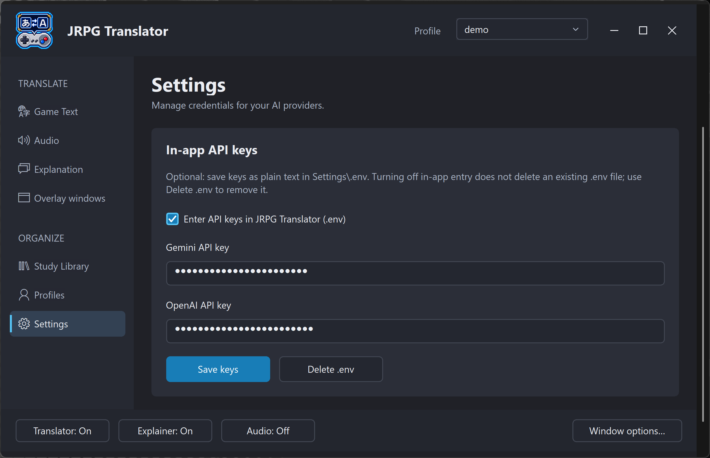
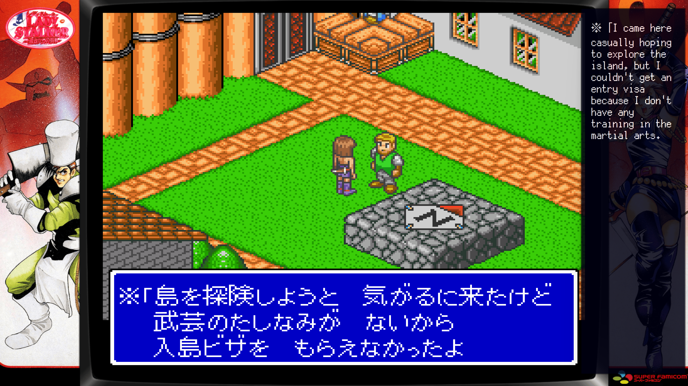

# 2. Download, setup, and your first translation

[← Introduction](01-introduction.md) · [Contents](README.md) · [Next: Interface and controllers →](03-interface-and-controller.md)

## Before you begin

Use Windows 10 or 11 and a packaged release of JRPG Translator. You will also need an internet connection and API access to a supported provider for the AI functions you want to use.

The packaged application is portable: extract it into a writable folder and keep its supporting files together. A full packaged build includes the runtime components needed by the tool; you should not need to install Python or AutoHotkey separately for ordinary use. The GitHub source-code ZIP is not the same thing as a ready-to-run release.

LaunchBox, Big Box, JoyToKey, and Anki are optional, separate applications.

## Download and extract

1. Open the [GitHub releases page](https://github.com/retrogamer0815/jrpg-translator-toolkit/releases).
2. Read the release notes and choose the packaged build you intend to use. A testing build may be listed separately from the latest stable release.
3. Extract the complete archive. Do not run the executable from inside the ZIP.
4. Place it somewhere your Windows account can write, such as a dedicated games/tools folder. Avoid a protected installation folder if you do not intend to manage its permissions.
5. Start **JRPG Translator.exe**.

Do not move only the executable: scripts, overlay components, Python, and settings are part of the application layout. If Windows blocks a downloaded archive or file, verify that it came from the expected repository before using Windows' unblock option. Do not disable system-wide security protection to run the tool.

*Figure S02. Keep the complete extracted folder together. Start JRPG Translator.exe for the main application.*

## Obtain an API key

The application uses provider APIs, not a provider's ordinary chat website. Create an API key in your own account and check the API project's billing, limits, and model access before sending requests.

### OpenAI

Use the [OpenAI API quickstart](https://developers.openai.com/api/docs/quickstart) and [API keys dashboard](https://platform.openai.com/api-keys). Consult [current API pricing](https://developers.openai.com/api/docs/pricing) for costs. Do not assume a chat-product subscription supplies API credits.

### Google Gemini

Create or manage a key in [Google AI Studio](https://aistudio.google.com/app/apikey). Google's [API-key guide](https://ai.google.dev/gemini-api/docs/api-key) explains the project/key setup, and its [billing guide](https://ai.google.dev/gemini-api/docs/billing) explains account tiers and billing.

Model availability, quotas, pricing, and regional access can change. This manual deliberately does not promise a particular model or free allowance.

### Keep keys private

An API key is a credential. Do not include it in screenshots, exported support files, public GitHub issues, or a shared portable folder. If one is exposed, revoke it in the provider dashboard and create a replacement.

## Add keys in JRPG Translator

1. Open **Settings → API keys**.
2. Enable in-app key storage/editing if you want the application to manage the keys.
3. Enter the key for each provider you plan to use.
4. Choose **Save keys**.
5. Check the displayed storage/status information.

*Figure S03. In-app key entry with both credentials masked. Save keys writes the local .env file; Delete .env is a separate action.*

In-app storage writes a local `Settings\.env` file. It is convenient, but it is a plain-text file, not an encrypted password vault. Masking a field on screen does not encrypt the saved value.

Turning off in-app key editing does **not** delete an existing `.env`. Use the explicit deletion action if you want to remove it, after ensuring another intended credential source is available.

Advanced users can supply environment variables instead:

- `OPENAI_API_KEY` for OpenAI.
- `GEMINI_API_KEY` for Gemini; the application also supports its Google-key compatibility setting.

Existing process environment values take precedence over values loaded from `.env`. If an old key keeps being used, check both sources. Restart JRPG Translator after changing external environment variables; restart LaunchBox too if it launches the tool.

## Choose the translation AI

On **Game Text**:

1. Select a **Provider** for screenshot translation.
2. Select a compatible image-capable **Model**.
3. Select a **Prompt**. A bundled translation prompt is the simplest starting point.
4. If you want to use the Explainer later, choose a prompt that includes the Japanese transcript, such as a bundled `with_transcript` or `with_kanji_reading` prompt.

The providers and models for Explanation and Audio are configured separately. Selecting a model here does not configure all three functions.

Use **Manage models...** if your intended model is absent. Models must support the relevant API operation and be available to your account; appearing in a list is not a guarantee that your key can use one.

## Make your first translation

1. Start a game and display a stable dialogue line.
2. In **Game Text**, choose **Change capture...**.
3. Select a region around the dialogue, or select the game window.
4. Finish the selection. This sets the target; it does not capture or translate yet.
5. Choose **Capture & Translate**, or use its configured shortcut.
6. Wait for the result in the Translator overlay.
7. Adjust the overlay's position or appearance if it covers important game content.

For an initial test, a clearly readable, small dialogue region is easier to diagnose than a full desktop capture. Avoid cutting off the speaker name or part of a character.

*Figure S04. A first translation result: the original dialogue remains in the game, while the Translator displays its translation on the right.*

If nothing appears, check the capture target, provider key, selected model, and whether the Translator overlay is visible. See [Troubleshooting](12-troubleshooting-and-advanced.md).

## What is saved, and when?

Most ordinary settings take effect and persist as you change them. There are important exceptions:

- API-key editing uses **Save keys**.
- Prompt, glossary, and other editors have their own save/confirm actions.
- A named **Profile** is a snapshot. Use **Save current** to update it; changing the live settings is not the same as rewriting that Profile.
- Startup overlay options control a future start/open sequence; they are not substitutes for the current show/hide controls.

Once the first translation works, create a Profile for the game. Add audio, study features, and LaunchBox integration afterward if you want them.

## Update an existing installation

1. Stop audio translation and close JRPG Translator and its overlays. Close LaunchBox / Big Box too if you are replacing the plugin.
2. Back up the complete **Settings** folder and any data stored in custom locations.
3. Read the new release's migration notes.
4. Prefer extracting the new package to a fresh folder, then migrating your settings according to those notes. This keeps the previous installation available for rollback.
5. Check keys, model selections, capture paths, Profiles, and a saved Study Library before resuming normal use.
6. Update the LaunchBox plugin separately if the release includes a new plugin package.

Do not overwrite your only backup with a newly migrated library. Database and settings formats may change between testing builds. A source-code checkout or a single new EXE should not be assumed to be a complete release upgrade.
