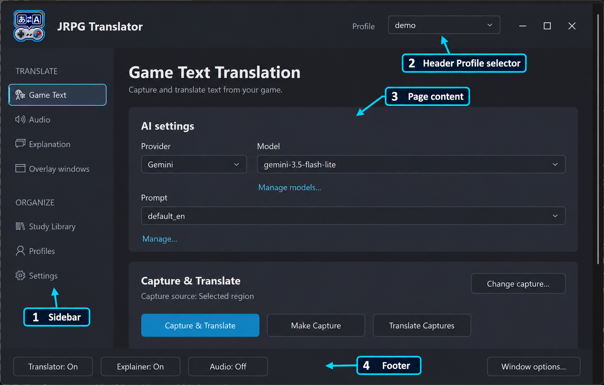
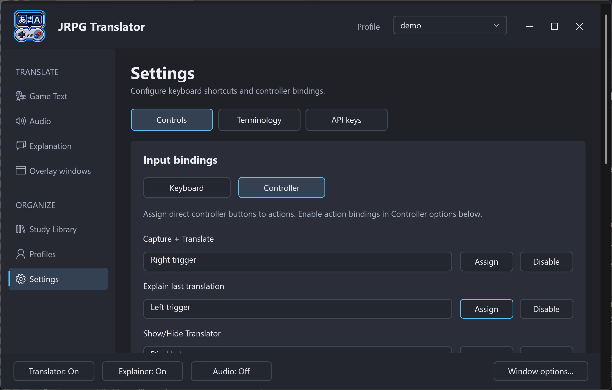
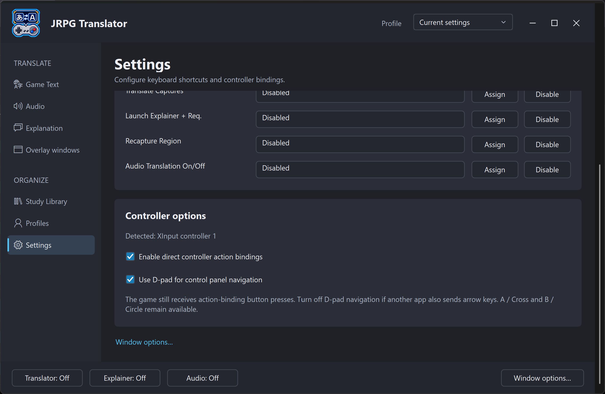

# 3. The interface, keyboard shortcuts, and controllers

[← Setup](02-setup.md) · [Contents](README.md) · [Next: Game Text Translation →](04-game-text-translation.md)

## Find your way around the desktop

The sidebar groups the main tasks:

| Page | Use it for |
| --- | --- |
| Game Text | Image-translation AI, capture actions, formatting, and capture/startup options |
| Audio | Audio AI, output language, playback-device selection, testing, and start/stop |
| Explanation | Explainer AI, explanation requests, saving options, and startup behavior |
| Overlay windows | Appearance and placement of the Translator and Explainer |
| Study Library | Open the separate library/reader window |
| Profiles | Create, select, apply, save, or delete saved settings |
| Settings | Controls, Terminology, and API keys |

The header's **Profile** dropdown is a quick way to apply a saved Profile. Its **Manage profiles...** entry opens the management page.

The footer provides current Translator, Explainer, and Audio controls, plus **Window options...** for the desktop control panel. These desktop window options are separate from the appearance of the output overlays.

*Figure S05. Desktop orientation: (1) sidebar navigation, (2) the header Profile selector, (3) the selected page's content, and (4) footer controls. Labels have been added for the manual; see the [original screenshot](images/game-text-page.png) without annotations.*

## Native controller navigation

An Xbox/XInput-compatible controller is the straightforward native-controller option. Connect it before configuring bindings and check the detection status under **Settings → Controls**.

| Input | Navigation action |
| --- | --- |
| D-pad | Move between controls |
| A / Cross | Activate the focused control or confirm |
| B / Circle | Go back or cancel, depending on the current screen |
| LB / RB, or L1 / R1 | Move backward/forward through control-center pages |
| Arrow keys | Keyboard equivalent of directional navigation |
| Enter / Esc | Keyboard confirm / back |
| Page Up / Page Down | Keyboard page navigation |

Some editors and selection dialogs have additional instructions. Follow the help shown in that dialog rather than assuming every button has the same meaning everywhere.

The desktop page cycle follows the visible page/subpage order, including the Translator and Explainer overlay sections and Settings' Controls, Terminology, and API keys sections.

**Study Library is a focus-only stop.** Moving to it with the shoulder buttons highlights the sidebar entry without opening a new window. Press A to open it, or continue with L/R to pass it.

Directional navigation should scroll page content into view as focus moves down. This matters on a 720p display: controls below the initial viewport are still part of the page. The footer is not intended as a shortcut that bypasses remaining page controls.

## Navigation and direct action bindings are different

There are two separate controller features:

- **Navigation** operates the app's visible controls.
- **Direct action bindings** invoke an assigned action, such as Capture & Translate, without navigating to its button.

The Controls page exposes separate switches for direct actions and D-pad navigation. Disable the feature that conflicts with your mapping setup rather than assuming one switch controls everything.

A native controller binding does not consume the button for the game. The game can still receive the same press. Pick combinations/buttons that will not accidentally advance dialogue, open a menu, or trigger another unwanted game action.

To assign a direct action, open the controller binding list, select the action, choose its assignment command, and press the intended controller button or trigger. Use **Disable** to clear an action you do not want. Test the result in a safe game scene.

*Figure S06a. Direct controller-action assignments. The bindings shown are an example; use Assign or Disable to customize your setup.*

*Figure S06b. Controller detection and navigation options. Direct action bindings and D-pad navigation can be enabled separately; the game still receives action-binding button presses.*

## Default keyboard shortcuts

These are the shipped defaults. Your saved settings may differ; **Settings → Controls** is the authoritative list for your installation.

| Action | Default |
| --- | --- |
| Capture + Translate | Ctrl+Shift+T |
| Explain last translation | Ctrl+Shift+E |
| Show/Hide Translator | Ctrl+Shift+H |
| Show/Hide Explainer | Ctrl+Shift+X |
| Show/Hide Control Panel | Ctrl+Shift+C |
| Make Capture | Ctrl+Shift+S |
| Translate Captures | Ctrl+Shift+D |
| Launch Explainer + request | Ctrl+Shift+A |
| Recapture Region | Ctrl+Shift+R |
| Audio Translation On/Off | Ctrl+Shift+L |

The keyboard-shortcut list offers change, disable, and default/reset actions. Keyboard shortcuts are shared settings, not per-game Profile contents.

Avoid shortcuts already reserved by the game, emulator, streaming software, or Windows tools. If an action happens twice, check for duplicate native and keyboard-mapped assignments.

## Use JoyToKey for short and long presses

JoyToKey is optional. It converts controller input into keyboard input, so it can invoke the same shortcuts as a physical keyboard. Its [advanced features](https://joytokey.net/en/advanced) include switching key assignments based on press duration.

A useful design is a short press for **Capture & Translate** and a long press for **Explain last translation** on one chosen button. This is an example, not a supplied default configuration.

1. Set and test the two keyboard shortcuts in JRPG Translator first.
2. In a JoyToKey profile, assign those shortcuts using its press-duration functionality.
3. Configure the duration behavior so a long press does not also send an unwanted short-press action.
4. Remove or disable a conflicting native direct-action assignment.
5. Test a short press, a long press, and holding the button while the game is active.
6. If using the LaunchBox plugin, select that JoyToKey profile for the game.

If JoyToKey sends arrow keys from the D-pad, consider turning off JRPG Translator's native D-pad navigation to avoid double movement. Likewise, avoid running two mapping tools that both translate the same controller input.

Other controllers can be usable through compatible mapping software, but device/driver support varies. “Direct controller bindings” here does not mean that every DirectInput device is guaranteed to behave like an Xbox controller.

## Controller-friendly does not mean text-free

Navigation, selection, toggles, and many dialogs are designed for controller use. Creating names, entering API keys, writing prompts, or editing explanation text may still require a keyboard or an appropriate on-screen input method. Set these up on the desktop before a controller-only playing session.

## Full-screen navigation

In the [Big Box dashboard](10-launchbox-and-big-box.md), D-pad/arrows select tiles, A/Enter activates them, and the shoulder buttons/Page Up/Page Down change pages. The help area describes the focused tile; focusing a tile is not the same as activating it.

When positioning an overlay or selecting a region, the sticks and confirm/cancel controls have a special role. Read the on-screen instructions before pressing a gameplay shortcut.
