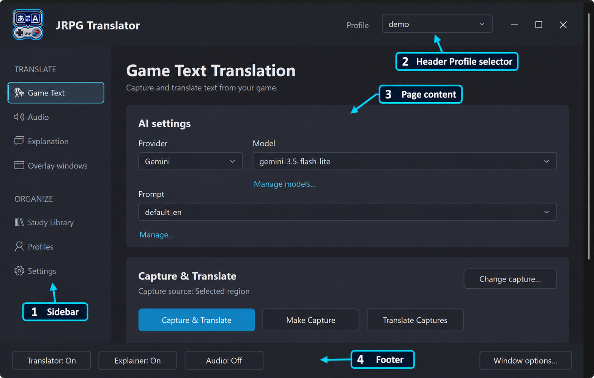

# 3. The interface and controller navigation

[← Setup](02-setup.md) · [Contents](README.md) · [Next: Controls and keyboard shortcuts →](03a-controls-and-shortcuts.md)

## Find your way around the desktop

The sidebar groups the main tasks:

| Page | Use it for |
| --- | --- |
| Game Text | Image-translation AI, capture actions, formatting, and capture/startup options |
| Audio | Audio AI, output language, playback-device selection, testing, and start/stop |
| Explanation | Explainer AI, explanation requests, saving options, and startup behavior |
| Overlay windows | Appearance and placement of the Translator and Explainer |
| Study Library | Open the separate library/reader window |
| Profiles | Create, select, apply, save, or delete saved settings |
| Settings | Controls, Terminology, and API keys |

The header's **Profile** dropdown is a quick way to apply a saved Profile. Its **Manage profiles...** entry opens the management page.

The footer provides current Translator, Explainer, and Audio controls, plus **Window options...** for the desktop control panel. These desktop window options are separate from the appearance of the output overlays.

*Figure S05. Desktop orientation: (1) sidebar navigation, (2) the header Profile selector, (3) the selected page's content, and (4) footer controls. Labels have been added for the manual; see the [original screenshot](images/game-text-page.png) without annotations.*

## Native controller navigation

An Xbox/XInput-compatible controller is the straightforward native-controller option. Connect it before configuring bindings and check the detection status under **Settings → Controls**.

| Input | Navigation action |
| --- | --- |
| D-pad | Move between controls |
| A / Cross | Activate the focused control or confirm |
| B / Circle | Go back or cancel, depending on the current screen |
| LB / RB, or L1 / R1 | Move backward/forward through control-center pages |
| Arrow keys | Keyboard equivalent of directional navigation |
| Enter / Esc | Keyboard confirm / back |
| Page Up / Page Down | Keyboard page navigation |

Some editors and selection dialogs have additional instructions. Follow the help shown in that dialog rather than assuming every button has the same meaning everywhere.

The desktop page cycle follows the visible page/subpage order, including the Translator and Explainer overlay sections and Settings' Controls, Terminology, and API keys sections.

**Study Library is a focus-only stop.** Moving to it with the shoulder buttons highlights the sidebar entry without opening a new window. Press A to open it, or continue with L/R to pass it.

Directional navigation should scroll page content into view as focus moves down. This matters on a 720p display: controls below the initial viewport are still part of the page. The footer is not intended as a shortcut that bypasses remaining page controls.

## Navigation and direct action bindings are different

There are two separate controller features:

- **Navigation** operates the app's visible controls.
- **Direct action bindings** invoke an assigned action, such as Capture & Translate, without navigating to its button.

The Controls page exposes separate switches for direct actions and D-pad navigation. The dedicated [Controls and keyboard shortcuts](03a-controls-and-shortcuts.md) page explains how to assign actions and avoid conflicts with game controls or keyboard-mapping tools.

## Default keyboard shortcuts

See the [default shortcuts and customization instructions](03a-controls-and-shortcuts.md#default-keyboard-shortcuts). **Settings → Controls** is the authoritative list for your installation; screenshot examples may use customized shortcuts.

## Use JoyToKey for short and long presses

The illustrated [JoyToKey walkthrough](03a-controls-and-shortcuts.md#use-joytokey-for-short-and-long-presses) maps **Explain last translation** and **Show/Hide Explainer** to the same controller button: a short press requests an explanation, and a long press shows or hides the overlay. It also explains how the two applications' profiles work with the plugin.

## Controller-friendly does not mean text-free

Navigation, selection, toggles, and many dialogs are designed for controller use. Creating names, entering API keys, writing prompts, or editing explanation text may still require a keyboard or an appropriate on-screen input method. Set these up on the desktop before a controller-only playing session.

## Full-screen navigation

In the [Big Box dashboard](10-launchbox-and-big-box.md), D-pad/arrows select tiles, A/Enter activates them, and the shoulder buttons/Page Up/Page Down change pages. The help area describes the focused tile; focusing a tile is not the same as activating it.

When positioning an overlay or selecting a region, the sticks and confirm/cancel controls have a special role. Read the on-screen instructions before pressing a gameplay shortcut.
