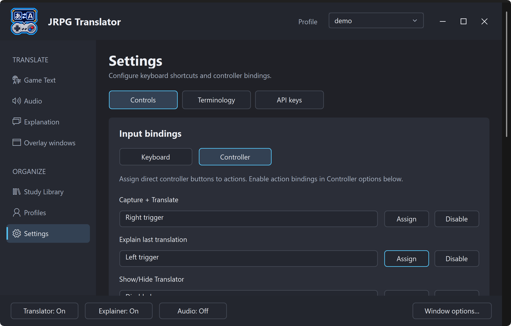
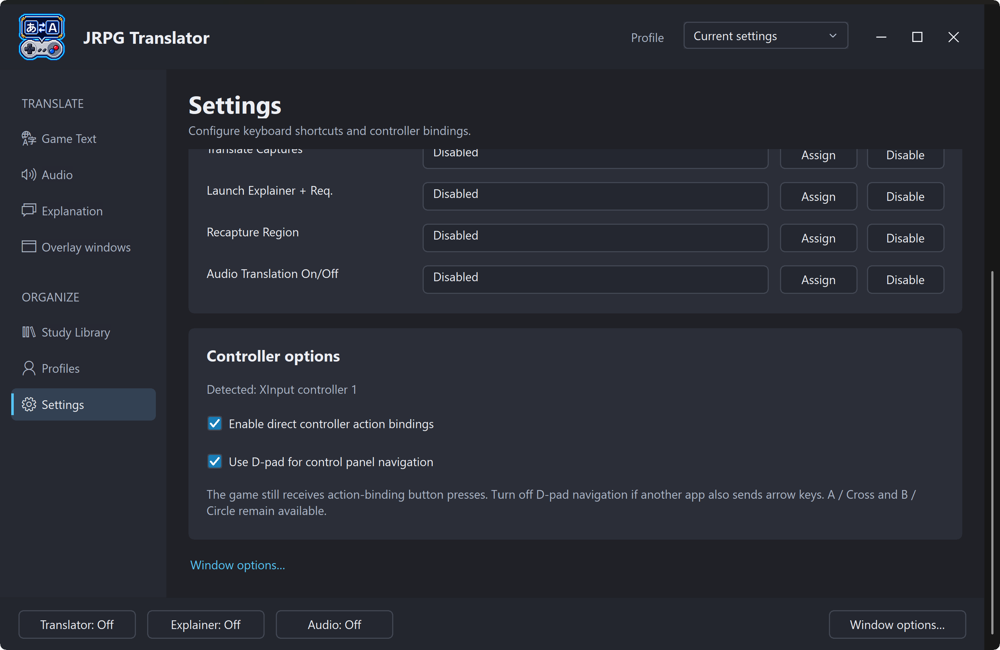
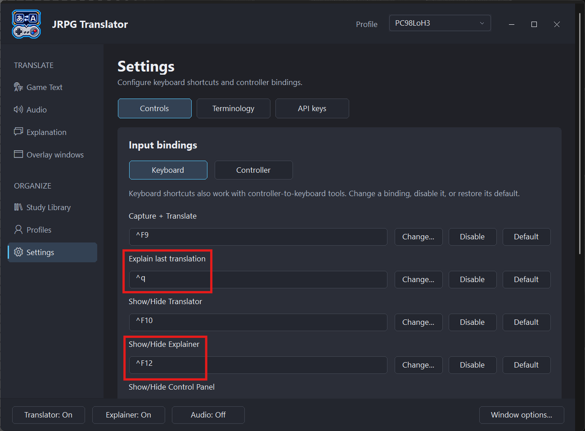
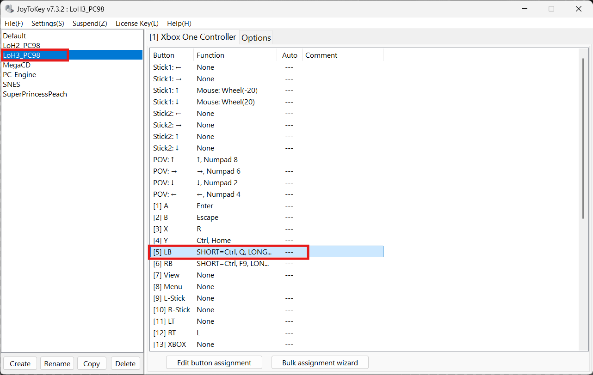
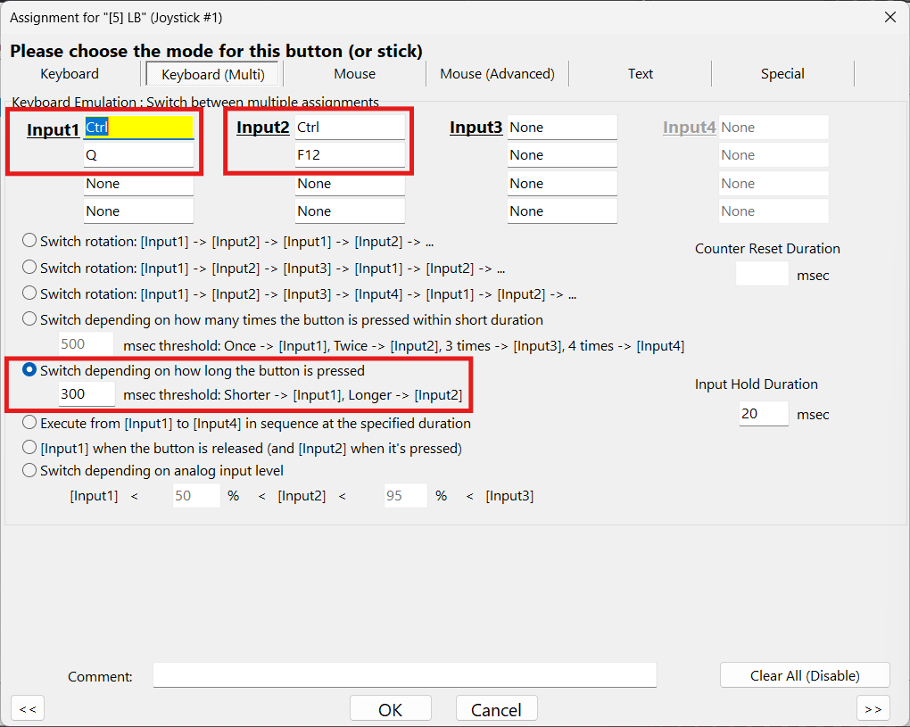

# 3a. Controls, keyboard shortcuts, and JoyToKey

[← Interface and controller navigation](03-interface-and-controller.md) · [Contents](README.md) · [Next: Game Text Translation →](04-game-text-translation.md)

Open **Settings → Controls** to configure keyboard shortcuts and direct controller bindings. For moving around the interface with D-pad/arrows, confirm, and back, see [controller navigation](03-interface-and-controller.md#native-controller-navigation).

## Direct controller action bindings

Direct action bindings invoke an action, such as **Capture + Translate**, without navigating to its button. They are separate from using the controller to navigate the app.

1. Connect an Xbox/XInput-compatible controller and check the detection status under **Settings → Controls**.
2. Under **Input bindings**, choose **Controller**.
3. Select **Assign** beside the action, then press the intended controller button or trigger.
4. Enable **direct controller action bindings** under **Controller options**.
5. Use **Disable** for actions you do not want, and test your assignments in a safe game scene.

*Figure S06a. Direct controller-action assignments. The bindings shown are an example; use Assign or Disable to customize your setup.*

*Figure S06b. Controller detection and navigation options. Direct action bindings and D-pad navigation can be enabled separately.*

A native controller binding does not consume the button for the game. The game can still receive the same press. Choose a button that will not accidentally advance dialogue, open a menu, or trigger another unwanted game action.

Other controllers can be usable through compatible mapping software, but device/driver support varies. Direct controller bindings do not guarantee support for every DirectInput device.

## Default keyboard shortcuts

Choose **Keyboard** under **Input bindings** to change a shortcut, disable it, or restore its default. These are the shipped defaults; **Settings → Controls** is the authoritative list for your installation.

| Action | Default |
| --- | --- |
| Capture + Translate | Ctrl+Shift+T |
| Explain last translation | Ctrl+Shift+E |
| Show/Hide Translator | Ctrl+Shift+H |
| Show/Hide Explainer | Ctrl+Shift+X |
| Show/Hide Control Panel | Ctrl+Shift+C |
| Make Capture | Ctrl+Shift+S |
| Translate Captures | Ctrl+Shift+D |
| Launch Explainer + request | Ctrl+Shift+A |
| Recapture Region | Ctrl+Shift+R |
| Audio Translation On/Off | Ctrl+Shift+L |

Keyboard shortcuts are shared settings, not per-game Profile contents. Avoid shortcuts already reserved by the game, emulator, streaming software, or Windows tools.

## Use JoyToKey for short and long presses

JoyToKey is optional but highly recommended if you plan to use multiple functions this tool offers. It converts controller input into keyboard input, so it can invoke JRPG Translator's keyboard shortcuts. For example its [press-duration feature](https://joytokey.net/en/advanced) lets **one controller button perform two different actions**, depending on how long you press it.

### 1. Check the shortcuts in JRPG Translator

Start in **Settings → Controls → Keyboard**. The two highlighted actions below are a useful pair: generate an explanation with a short press, then show or hide the Explainer overlay with a long press of the same button. The same could be done with the pair Capture + Translate and Show/Hide Translator.

*Figure S06c. Start with the two highlighted keyboard shortcuts in JRPG Translator. These shortcuts are shared across Profiles.*

| Press on the same button | Shortcut in this example | Action |
| --- | --- | --- |
| Short press (less than 300 ms) | Ctrl+Q | Explain last translation |
| Long press (more than 300 ms) | Ctrl+F12 | Show/Hide Explainer |

These are **customized shortcuts**, not the defaults listed above. In the screenshot, `^q` means Ctrl+Q and `^F12` means Ctrl+F12. Either configure those shortcuts in JRPG Translator or use your own existing shortcuts in the JoyToKey assignments below.

Test both shortcuts from the keyboard first. **Explain last translation** requests an explanation of the latest Japanese text from Game Text Translation; it does not make a new capture. **Show/Hide Explainer** changes the overlay's visibility without requesting another explanation.

### 2. Choose the JoyToKey profile and button

In JoyToKey, select the profile you want to use for the game, then select the button and choose **Edit button assignment**. This example uses **[5] LB**, the Xbox controller's left shoulder button.

*Figure S06d. Select the game's JoyToKey profile and the button that will handle both actions.*

The highlighted profile in JoyToKey stores its per-game button mappings. It is separate from JRPG Translator [profiles](09-profiles.md), which can save the D-pad navigation preference alongside capture and overlay settings; keyboard shortcuts and native direct-action assignments remain shared. The [plugin](10-launchbox-and-big-box.md#configure-a-game) can load the chosen JRPG Translator [profiles](09-profiles.md) and JoyToKey profile when a game starts. Their names do not have to match.

### 3. Assign a short press and a long press

1. Open the **Keyboard (Multi)** tab in the button-assignment window.
2. For **Input1**, enter **Ctrl** and **Q** in separate key fields. This is the short-press action.
3. For **Input2**, enter **Ctrl** and **F12** in separate key fields. This is the long-press action. Substitute your configured shortcuts if they differ.
4. Select **Switch depending on how long the button is pressed** and set the threshold to **300 msec**, as shown. You can adjust this threshold to suit your timing.
5. Choose **OK**, then test a short press and a long press while the game is active. Confirm that each press invokes only its intended action.

*Figure S06e. Use the highlighted Keyboard (Multi) tab to assign two actions to LB: shorter presses use Input1 to request an explanation; longer presses use Input2 to show or hide the Explainer.*

You can use the same approach for other pairs of JRPG Translator shortcuts. The mappings shown here are an example, not a supplied JoyToKey configuration.

## Avoid duplicate input

- Remove or disable a conflicting native direct-action binding when JoyToKey handles the same button.
- If JoyToKey sends arrow keys from the D-pad, turn off **Use D-pad for control panel navigation** in JRPG Translator if you get double movement. The two controller switches are independent.
- Avoid running two mapping tools that both translate the same controller input.
- After changing a JRPG Translator keyboard shortcut, update the corresponding JoyToKey assignments too. Changing one does not rewrite the other.

Test the setup in a safe game scene, including a held button, before relying on it during play.
