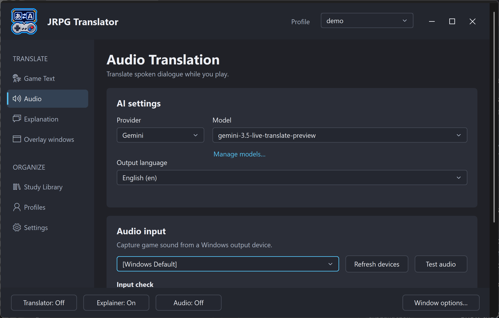

# 5. Audio Translation

[← Game Text Translation](04-game-text-translation.md) · [Contents](README.md) · [Next: Explanation →](06-explanation.md)

## What it translates

Audio Translation captures sound from a selected Windows playback/output device and sends it to the chosen live-audio AI service. Translated dialogue appears in the Translator overlay.

This is separate from screenshot translation. It does not require a capture region, and selecting an image-translation model does not select the audio model.

The input is playback audio, not automatically a microphone. Other applications using the same output device can be heard too, so close or mute unrelated audio before starting.

## First-time setup

1. Open **Audio**.
2. Choose the audio **Provider** and a compatible live-audio **Model**.
3. Choose the **Output language**.
4. Select the output device that is actually playing the game.
5. Play a voiced scene and choose **Test audio**.
6. Read the input-check result.
7. Choose **Start audio translation** when you are ready.

On a shorter screen, the start button may be below the initial view. Scroll or continue downward through the page controls.

*Figure S09a. Audio AI, language, and playback-device selection. The input-check result and start control are farther down the page.*

> **Screenshot S09b — Audio test result and start control (to be added).** Show a completed local input check and the Start audio translation button.

**Test audio** checks local audio capture; it is not an AI translation request and does not prove that the provider key or model works. A successful input test followed by a provider error usually points to the AI configuration rather than the selected output device.

## Device selection

**[Windows Default]** follows the default playback choice when the audio process opens it. For a predictable setup, you can select the particular speakers, headset, or virtual device used by the game.

Use **Refresh devices** after connecting a headset or changing your audio setup. If you change the Windows output while translation is running, stop translation, select/test the intended device, and start again.

If the game uses a different device from Windows' default, selecting the default can produce silence even though you can hear the game elsewhere.

## Model and language

Use the model manager to maintain the audio model list. A model suitable for text chat or screenshots is not necessarily compatible with streaming audio. Check provider access and compatibility if a manually added model fails.

The output-language setting tells the audio translator which language to produce. It is independent of the language requested by a Game Text prompt.

For predictable results, stop the stream before changing provider, model, language, or device, then restart it. Do not assume an already-running connection has adopted every new setting.

## During play

Use the page's start/stop control, the desktop footer Audio control, the full-screen Audio Translation tile, or your assigned shortcut to toggle the stream.

The Translator overlay displays incoming translated text; it is not a synthesized-voice feature. There can be a delay while the service interprets speech. Music, sound effects, overlapping speakers, accents, and very short fragments can affect results.

Stop the stream when you no longer need it. Leaving it running through menus or unrelated audio can send unnecessary content and consume provider usage.

## Terminology and saving

Audio uses the selected **local target-language corrections** when Terminology Overrides are enabled. The Japanese-to-target-language rules used by screenshot translation and Explanation are not currently sent as audio terminology instructions. Restart the audio process after changing the selected correction glossary or its contents.

Audio output is not the Japanese-source input used by **Explain latest text**. The explanation/Study Library workflow begins with Game Text Translation, not automatically with every spoken line.

## When there is no output

Expand **Audio testing & troubleshooting** on the page, then separate the problem into two questions:

1. **Can the tool capture the game sound?** Check the output device and local input test.
2. **Can the AI service process it?** Check the key, compatible live model, account access, quotas, and network.

If translated text is being produced but you cannot see it, check that the Translator overlay is open and positioned on the current monitor. More checks are in [Troubleshooting](12-troubleshooting-and-advanced.md).
