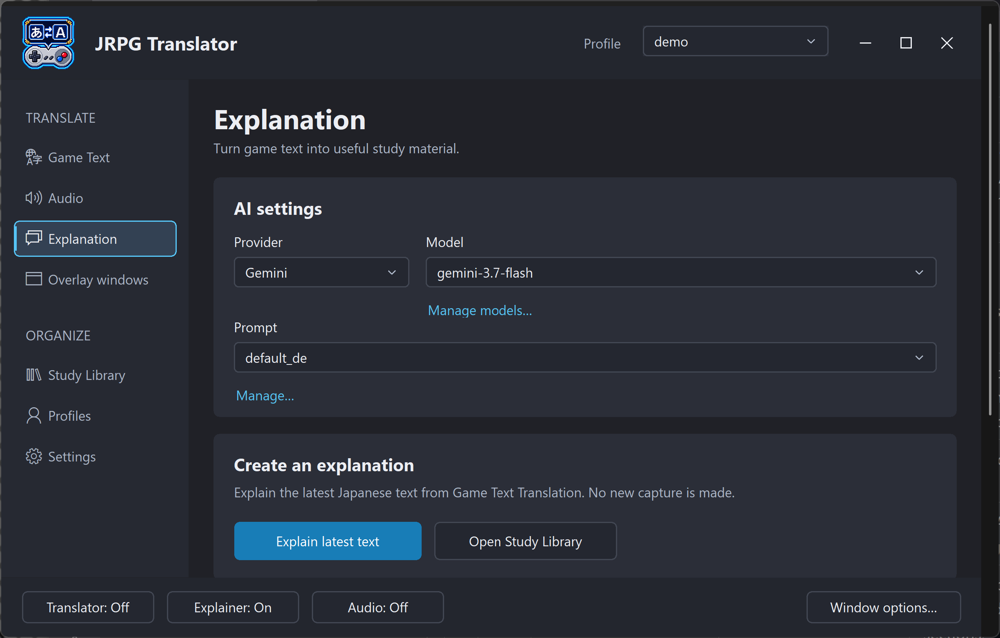
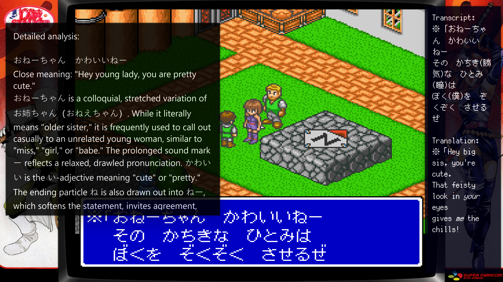

# 6. Explanation

[← Audio Translation](05-audio-translation.md) · [Contents](README.md) · [Next: Overlay windows →](07-overlay-windows.md)

## What the Explainer explains

The Explainer is an optional learning assistant for Japanese text obtained through Game Text Translation. A suitable prompt can ask for vocabulary, readings, grammar, sentence structure, meaning, and nuance.

It uses its own provider, model, and prompt. A fast translation model and a different explanation model can therefore be used together.

**Explain last text does not take a new screenshot.** It uses the latest available Japanese source from the image-translation workflow. If you have advanced the game since the last capture, capture and translate the new line first.

## Create your first explanation

1. On **Game Text**, choose a transcript-aware prompt.
2. Capture and translate a dialogue line.
3. Open **Explanation**.
4. Choose its **Provider**, **Model**, and **Prompt**.
5. Choose **Explain last text**, or use the configured explanation action.
6. Read the response in the Explainer overlay.

If no Japanese source is available, check the translation prompt and output format rather than repeatedly requesting explanations. A translation-only response may not provide the source the Explainer needs.

*Figure S10a. Explanation AI settings and actions. Explain last text uses the latest Japanese source from Game Text Translation; Open Study Library opens previously saved study material.*

*Figure S11. The Explainer breaks down the latest Japanese source while the Translator shows the transcript and translation. This is a real output example, not a guarantee of AI accuracy.*

## Explain versus show/hide

Showing the Explainer window and requesting an explanation are different actions. The Controls list includes a show/hide action as well as explanation-request actions, including **Launch Explainer + request**.

If you only want to reread the current explanation, show the overlay instead of sending another AI request. New requests can incur additional provider usage.

## Customize the explanation prompt

Use the prompt **Manage...** menu to edit, create, or delete an explanation prompt. These prompts are separate from Game Text prompts.

Useful adjustments include the language used for explanations, how much grammar terminology is assumed, or how concise the response should be. Start from a bundled prompt and change it gradually.

If you plan to use the Study Library and vocabulary tools, retain the structured sections expected by the bundled explanation format. Replacing the format with a completely free-form essay can make section extraction and vocabulary presentation less useful.

Model explanations can be plausible but wrong. Check important points against the original sentence and reliable language references; a recommendation score is not a grammatical correctness guarantee.

## Decide what to save

| Option | What it does |
| --- | --- |
| Save to Study Library | Saves explanations for later searching and study in the selected Library |
| Include source screenshots | Keeps original game images with saved Library entries; depends on Library saving |
| Save plain-text copies | Also saves text files independently of the Library |

Library entries are associated with the active JRPG Translator Profile, or **Unsorted** when there is no active Profile. This Profile metadata is not the same as the selected Library's name.

Choose the intended Library before generating material. If you want the choice recalled for a game, save it in that game's Profile.

Plain-text copies are stored under `Settings\Explanations` and its Profile subfolders. They are useful for independent reading or backups but are not a replacement for the Library database and its metadata.

The saving options control future output. Disabling one does not delete explanations or screenshots already saved.

> **Screenshot S10b — Explanation saving and startup options (to be added).** Show the lower-page Library, screenshot, plain-text saving, and Explainer startup controls.

## Startup options

The Explanation page's startup controls determine whether the Explainer should open and whether it should open always on top. These choices apply when the tool or Explainer next opens; they do not necessarily alter an already-open overlay.

Use [Overlay windows](07-overlay-windows.md) for current appearance and placement, and [Profiles](09-profiles.md) to save game-specific startup/overlay preferences.

## Continue studying later

Choose **Open Study Library** to browse saved material without returning to the original game scene. The reader can display saved versions, source screenshots, and extracted sections. You can later generate another explanation version, review study candidates, or create an Anki card.

Those later AI requests and Anki writes are explicit actions; simply opening the Library does not require regenerating your explanations.
