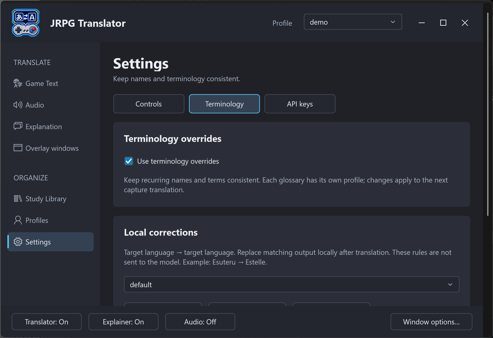
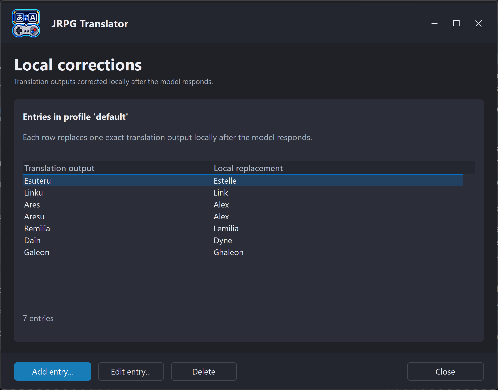

# 8. Terminology Overrides

[← Overlay windows](07-overlay-windows.md) · [Contents](README.md) · [Next: Profiles →](09-profiles.md)

## Why use terminology rules?

Names, places, and invented terms can be translated inconsistently. A glossary helps you request or enforce your preferred wording without rewriting the main prompt for every game.

Open **Settings → Terminology** and enable **Use terminology overrides**. There are two different kinds of rules, with independent selected glossary profiles.

*Figure S14a. The master switch and local-correction glossary. The independent Japanese-to-target-language rule section is farther down the page.*

> **Screenshot S14b — Both terminology rule selections (to be added).** Show the local-correction and Japanese-to-target-language glossary selectors and their management controls; use two crops if needed.

## The two rule types

| Type | Purpose | Example |
| --- | --- | --- |
| Local corrections: target language → target language | Replace a known output form with the preferred form after generation | `Esuteru` → `Estelle` |
| Japanese → target language | Give the AI a preferred rendering for Japanese names/terms | `エステル` → `Estelle` |

### Local corrections

These are useful when an unwanted form repeatedly appears in the generated target-language text. They operate locally on the output rather than asking the model to reconsider the sentence.

Use specific terms. An overly broad replacement can alter unrelated words or contexts. Case/word-boundary handling helps, but a replacement rule is not a full semantic understanding of the sentence.

### Japanese-to-target-language rules

These are supplied as instructions to the model. They can guide a name before it is translated, but an AI instruction is not a guarantee of compliance.

If the source name was misread from the image, improve the capture first. A correct glossary cannot reliably repair every incorrect transcription.

## Where each type applies

| Feature | Japanese → target rules | Local target → target corrections |
| --- | --- | --- |
| Game Text Translation | Yes | Yes |
| Explanation | Yes | Yes |
| Audio Translation | Not currently sent as source-term instructions | Yes |

In explanations, source text is protected where appropriate so that terminology correction does not intentionally rewrite the Japanese being studied.

Restart Audio Translation after switching the selected local glossary or editing its entries. Its running process may still hold the glossary it loaded at startup.

## Create a game-specific glossary

1. Open the relevant terminology section.
2. Create a named glossary profile, or select an existing one.
3. Open **Manage entries...**.
4. Add the source form and desired replacement in the two-column editor.
5. Save the edits.
6. Select that glossary profile for the correct rule type.
7. Test with a known line.
8. Save the selection in the game's JRPG Translator Profile.

*Figure S15. The local-corrections glossary lists exact translation outputs and their replacements. Use Add entry or Edit entry to change a rule; these are local corrections, not Japanese-source hints sent to the model.*

The two dropdowns are independent. You can combine one Japanese-source glossary with another local-correction glossary. Do not assume that selecting a name in one dropdown changes the other.

## Saving and sharing

A JRPG Translator Profile stores the selected glossary names and the enable setting, not a complete embedded copy of every rule. Back up the glossary files too.

The files are stored under `Settings\glossaries\<name>\`. Historical filenames are `jp2en.txt` and `en2en.txt`; the user-facing concepts are Japanese-to-target-language and target-language-to-target-language, not necessarily English-only.

Use the in-app editor unless you need to maintain files manually. Back up a glossary before bulk changes or deletion, especially if several game Profiles reference it.

## Troubleshoot an ineffective rule

Check the enable switch, selected glossary for the appropriate rule type, exact source spelling, and whether the output is from a newly generated result. Changing a glossary is not a bulk rewrite of every saved explanation.

For audio, use the local-correction side. For image translation, verify the name was actually captured and recognized. If several rules overlap, simplify them and test one at a time.
