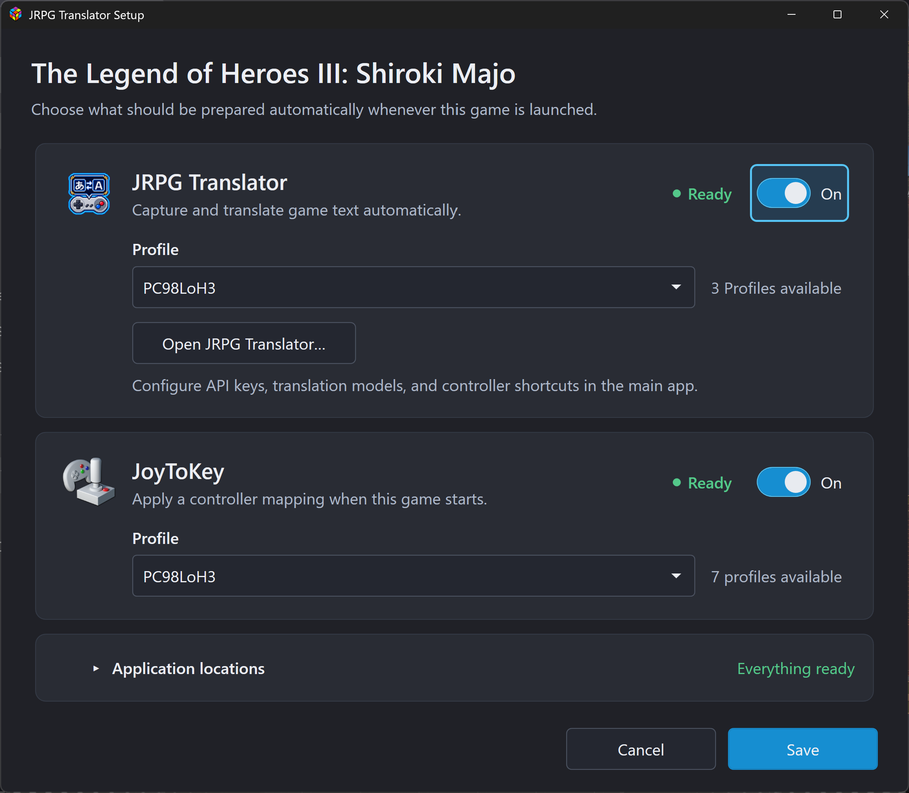
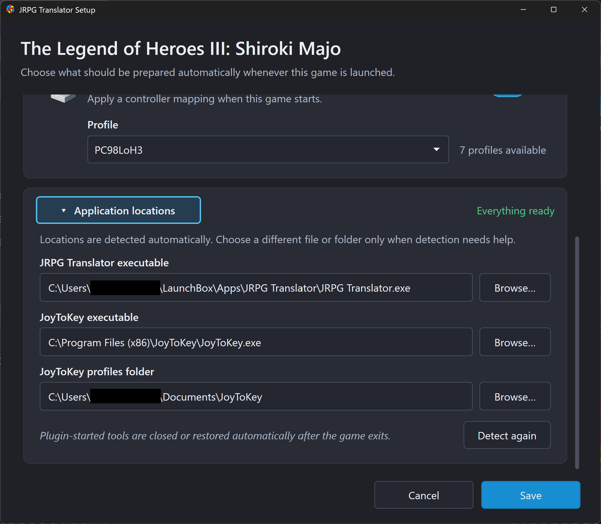
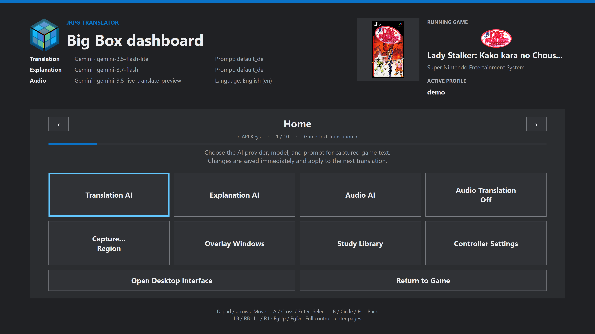

# 10. LaunchBox, Big Box, and the full-screen dashboard

[← Profiles](09-profiles.md) · [Contents](README.md) · [Next: Study Library →](11-study-library.md)

## What the plugin adds

The optional plugin prepares JRPG Translator and, if enabled, JoyToKey when a particular game launches. You can choose a JRPG Translator Profile and a JoyToKey profile per game.

You can still use JRPG Translator manually without this plugin. Configure and test the main application first, so plugin setup is about automatic launching rather than diagnosing an unconfigured API account.

## Install the packaged plugin

1. Close **LaunchBox** and **Big Box**.
2. Obtain the plugin package intended for your JRPG Translator release.
3. Extract it into LaunchBox's **Plugins** folder.
4. Check that the layout includes:
   `LaunchBox\Plugins\JRPG Translator Integration\JrpgTranslator.LaunchBox.dll`.
5. Start LaunchBox.
6. Right-click a game and choose **JRPG Translator Setup...**.

The same setup command is available from a game's details menu in Big Box.

Use the package's compatible LaunchBox/runtime requirements. Installing a .NET **SDK** is a developer/build requirement, not a general instruction for users of the packaged DLL. If a plugin fails to load, diagnose the reported runtime compatibility instead of installing unrelated SDK versions.

## Configure a game

The setup window has separate JRPG Translator and JoyToKey sections.

1. Enable **Use JRPG Translator with this game**.
2. Choose the desired JRPG Translator Profile.
3. Optionally enable JoyToKey and choose its profile.
4. Check the readiness indicators.
5. Choose **Save**.

*Figure S17. Enable each tool independently, choose its Profile, check readiness, and save the game's setup. Matching Profile names are convenient but refer to separate configurations.*

### None — use current settings

Choosing **None — use current settings** means no saved JRPG Translator Profile is applied at launch. It does not mean JRPG Translator is disabled. The application's current settings, including its startup-overlay choices, are used.

Use this when you want automatic launching without automatic Profile selection. Use a named Profile when reproducibility for that game matters.

### JoyToKey is independent

You can configure a different controller mapping for each game. JoyToKey's profile is a keyboard-mapping configuration, not a JRPG Translator settings Profile.

Make sure its mapped shortcuts match the shortcuts currently configured in JRPG Translator. Changing a JRPG Translator shortcut does not rewrite a JoyToKey profile.

## Application locations and readiness

If automatic detection cannot find something, expand **Application locations** and browse to:

- **JRPG Translator.exe**
- **JoyToKey.exe**
- The folder containing JoyToKey profiles

Refresh profile lists after creating or moving profiles if they are not yet visible.

*Figure S18. Expand Application locations to correct a detected file or folder. Browse selects a replacement location; Detect again reruns automatic detection. Personal account names are redacted in this example.*

The readiness indicators help identify missing executables or configuration resources. **Ready is not an API-key or network test.** Use the main application to configure keys and make a test translation.

The locations disclosure supports controller activation: focus it and press A/confirm to expand or collapse it. The rest of the window can be navigated with the controller or arrow keys and confirm/cancel controls.

Paths inside the LaunchBox installation can be stored relatively, which helps when moving a portable LaunchBox folder. Paths to tools outside that folder can still need updating after a move.

## What happens at launch and exit?

| Situation | Plugin behavior |
| --- | --- |
| JRPG Translator is not running | Starts it in the background and applies the chosen Profile before startup overlays open |
| JRPG Translator is already running | Applies the selected Profile without restarting it |
| JoyToKey is not running and is enabled | Starts it with the configured profile |
| JoyToKey is already running | Switches to the configured profile |
| The game exits | Closes tools it started; preserves pre-existing instances and restores the previous JoyToKey profile where applicable |

Applying a Profile to an already-running JRPG Translator does not automatically perform its startup overlay sequence. If a window is hidden, use its show/hide action.

Configure startup overlays on the Profiles page and **Save current** before expecting a newly launched game session to use those choices.

## Open and navigate the Big Box dashboard

For a Big Box session prepared by the plugin, the control-panel action opens the controller-oriented full-screen interface. Use your configured **Show/Hide Control Panel** action during the game; the default keyboard shortcut is Ctrl+Shift+C.

The dashboard header shows game/session information, active Profile, and the three current AI configurations. A neutral placeholder is used when game artwork is unavailable.

*Figure S19. Home shows the current game and AI configuration in the header. The help area explains what the focused tile does; the bottom hints show how to move, select, go back, and change pages.*

### Pages

The current page cycle is:

1. Home
2. Game Text Translation
3. Audio Translation
4. Translation Window
5. Explanation
6. Explanation Window
7. Terminology Overrides
8. Profiles
9. Controls
10. API Keys

Use **LB/RB**, **L1/R1**, or **Page Up/Page Down** to change pages. Use D-pad/arrows within a page and A/Enter to activate. B/Esc goes back or closes the current layer as indicated on screen.

There is no Paths page in the current interface. Advanced executable and diagnostic options are described under [advanced configuration](12-troubleshooting-and-advanced.md#advanced-controlini-settings).

### Home shortcuts

Home provides quick access to the Translation, Explanation, and Audio AI choices, the Audio Translation on/off control, capture setup, overlays, Study Library, and controller settings.

The three AI tiles configure their respective service/model/prompt or language choices. They are not all “start translation” buttons. Read the help text for the focused tile.

### Return to the game or desktop

- **Return to Game** leaves the dashboard so you can continue playing.
- **Open Desktop Interface** switches to the desktop configuration UI.
- **Study Library** opens the study interface; navigating to its tile alone does not generate an explanation or contact Anki.

Capture selection and overlay positioning temporarily show the relevant selection/positioning view. Confirm or cancel to return to the dashboard.

## After moving or updating the installation

Reopen one game's setup and check application paths, profile names, and readiness. A portable move does not install missing fonts, transfer Windows environment variables, or guarantee that an external JoyToKey location still exists.

Back up plugin configuration with the LaunchBox installation, as well as JRPG Translator's Settings folder. The main application's Profile files alone do not include all plugin per-game selections.
