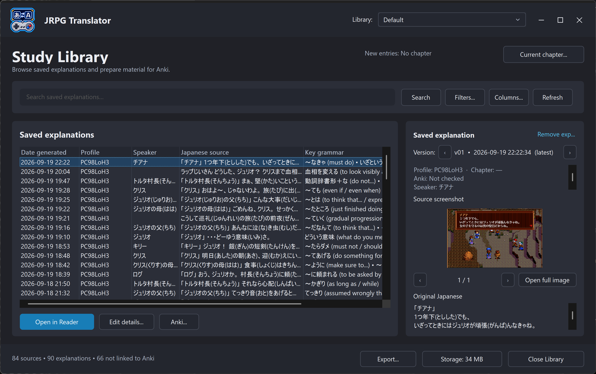
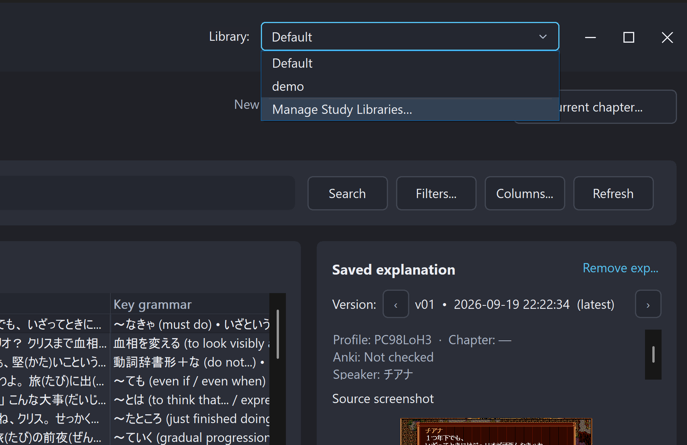
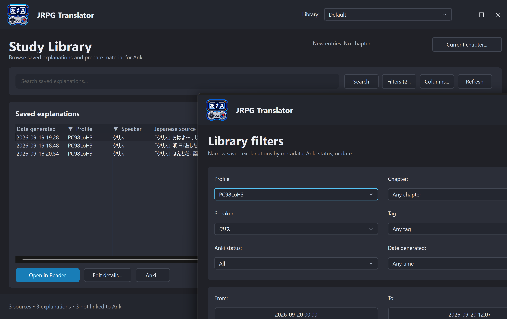
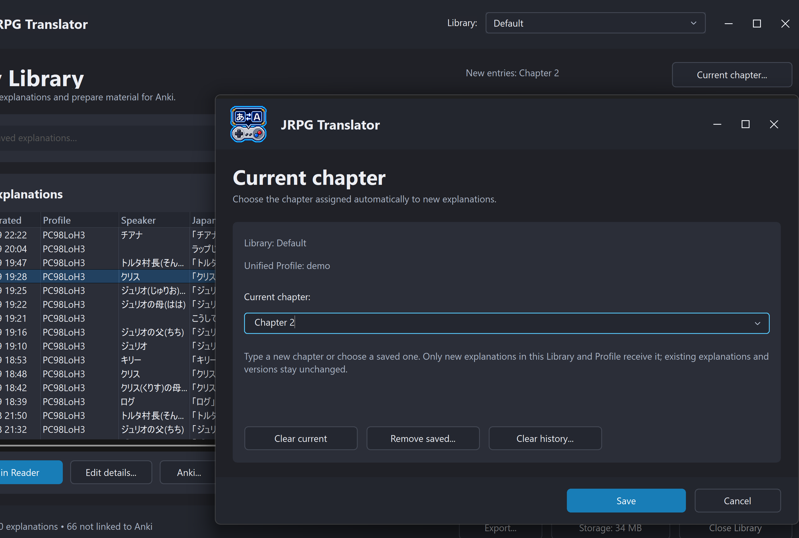
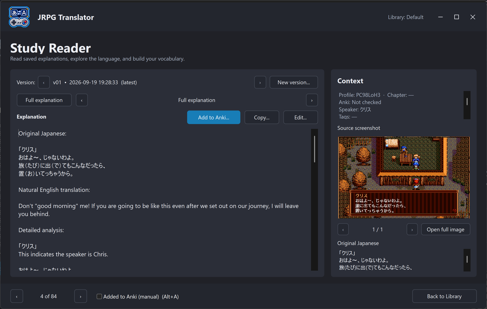

# 11. Study Library and the reader

[← LaunchBox and Big Box](10-launchbox-and-big-box.md) · [Contents](README.md) · [Next: Recommendations →](11a-study-recommendations.md)

## What is stored

A Study Library stores explanations, their Japanese source, metadata, versions, and optionally the original screenshots. It lets you return to interesting dialogue without finding the same scene again.

The Library is useful without Anki or AI recommendations. Reading, searching, organizing, and exporting saved content do not require generating it again.

## Start a Library workflow

1. In **Explanation**, enable **Save to Study Library**.
2. Enable **Include source screenshots** if you want the visual context preserved.
3. Open **Study Library** from the sidebar or the Explanation page.
4. Apply the game Profile you want recorded as metadata.
5. Check the selected Library after applying the Profile, and choose the intended destination if necessary. Save that choice with the Profile if it should be recalled next time.
6. If useful, set the current chapter for future entries.
7. Capture/translate Japanese text, then generate an explanation.
8. Return to the Library and refresh if the new entry is not yet shown.

*Figure S20. Select a row to inspect its saved explanation and source context on the right. Open in Reader provides a dedicated reading view.*

The selected Library is the storage destination. The active Profile is the game/context label attached to the material. A Library can contain entries from multiple Profiles.

## Manage Libraries

Open the **Library** dropdown and select its final **Manage Study Libraries...** entry. There is no separate Manage button beside the dropdown in the current interface.

Use the manager to create, rename, archive, or restore named Libraries.

*Figure S21a. Manage Study Libraries is the final, separated command in the Library dropdown.*

> **Screenshot S21b — Library manager (to be added).** Show the create, rename, archive, and restore options for named Libraries.

- **Default** is a special built-in Library; it cannot be renamed or archived like a named Library.
- **Archive** moves a Library out of the active list. It is not the same as deleting all its data.
- Archiving the active named Library returns the application to Default.
- **Restore** brings an archived Library back; a name conflict may require another name.

If a game should automatically select a particular Library, save that selection with its JRPG Translator Profile. Renaming or moving a Library warrants checking Profiles that refer to it.

## Find entries in the table

Search can cover Japanese, explanation text, grammar, chapter, speaker, and tags. Combine it with **Filters...** to narrow the result by Profile, chapter, speaker, tags, Anki status, or date.

If material seems missing, clear filters and search, confirm the selected Library, and refresh before assuming it was deleted.

The table can display:

- Generation date
- Profile
- Chapter
- Speaker
- Tags
- Original Japanese
- Key grammar
- Number of explanation versions
- Anki-related status

Use **Columns...** to choose the useful columns and their presentation. Column visibility/order and width preferences help keep the table usable on a smaller screen. Original Japanese remains the essential source identifier.

*Figure S22a. Profile and speaker filters narrow the table to matching dialogue. This crop shows the filter choices, not the complete dialog or column settings.*

> **Screenshot S22b — Complete filters and column selection (to be added).** Show the full Filters dialog, including its action buttons, and the Columns settings or a table displaying Profile, Chapter, Japanese, Key grammar, and Versions. Use separate images if needed.

An Anki link-check result such as **Found in Anki**, **Not found**, or **Not checked** is not interchangeable with a manually edited “Added to Anki” flag. See the [Anki chapter](11b-anki.md).

## Chapters, speakers, and tags

Use **Current chapter...** to label future entries for the relevant Profile in the current Library. You might use an in-game chapter name, location, or your own session label.

Changing the current chapter does not retroactively move every previous entry into that chapter. Select existing rows and use **Edit details...** for corrections or bulk metadata changes.

A practical tagging system is small and consistent: for example, `grammar-past`, `quest-main`, or `review-later`. Too many nearly identical tags make filtering harder.

*Figure S23a. Set a chapter for future explanations in the Library and Profile identified by the dialog. Existing entries are not changed by this setting.*

> **Screenshot S23b — Edit existing-entry details (to be added).** Show editing chapter, speaker, or tags for a selected saved explanation.

## Read an explanation

Select a row to inspect the source and available versions. Use **Open in Reader...** for the focused reading view.

In the reader, use the entry, version, and section navigation controls to move through saved material. Inspect vocabulary extracted from the explanation where available.

The **Copy...** menu can copy the current section or full explanation. When viewing the original-Japanese section, **Copy Japanese without readings** removes attached kana readings while retaining the Japanese words; it does not strip every ordinary parenthetical explanation.

Source screenshots retain the game's original context. If more than one is attached, use the image arrows; **Open full image** shows the selected image at a useful size.

*Figure S24. Read the saved explanation alongside its game context. Version controls are at the top, entry navigation is at the bottom, and Add to Anki opens a separate review step.*

No screenshot is available if it was not saved with the entry or its file is missing. Turning on screenshot saving now cannot recreate old images from an earlier game scene.

## Versions and corrections

Repeated explanations of the same stored source can be kept as versions rather than forcing you to discard the earlier interpretation.

Use the reader's editing and new-version actions for their different purposes:

- **Editing saved content** changes the local explanation text you are correcting. Use **Edit current section...** for a focused correction or **Edit full explanation...** for the whole response, then save or cancel. Keep section headings intact: the reader uses them for navigation. **Revert manual edits...** is available when that version has manual edits.
- **Generating a new explanation version** makes an AI request using the selected/current explanation configuration and preserves the earlier version for comparison.

Check the provider/model/prompt confirmation before generating. A newer version is not automatically a better one; compare it with the source.

Deleting a version requires confirmation. If it is the only version, removing it also removes that source entry from the Library. The application creates a database backup first and moves saved screenshots involved in removal into the Library's Trash folder. Separate plain-text copies are not deleted by this action.

Keep the reported recovery-backup path if you might need to undo a mistake. This is not a promise of an automatic one-click undo; close the app and make another backup before attempting a database restore.

## Export and storage

**Export...** creates an Excel workbook for browsing or working with Library data outside the app. An export is not a full restorable Library backup: database state, screenshots, and other supporting files need separate preservation.

**Storage...** helps inspect the storage used and locate the Library folder. Image attachments can account for much more disk space than the text.

Default locations are:

| Data | Location relative to the application |
| --- | --- |
| Default Library | `Settings\Study Library` |
| Named Libraries | `Settings\Study Libraries\<name>` |
| Archived Libraries | `Settings\Study Libraries Archive` |

Back up complete Library folders while the app is closed, or back up the entire Settings folder. Do not copy only screenshots and expect the table metadata to reappear.

## A manageable routine

During play, save explanations with the current game/chapter context. Afterward, filter to that session, correct important metadata, and read the entries you care about.

Then optionally [review study recommendations](11a-study-recommendations.md) and [add selected material to Anki](11b-anki.md). You do not need to turn every line of dialogue into a flashcard.
