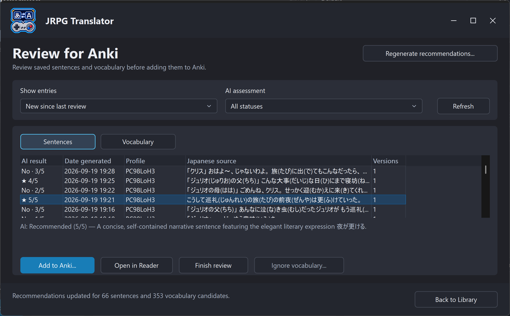
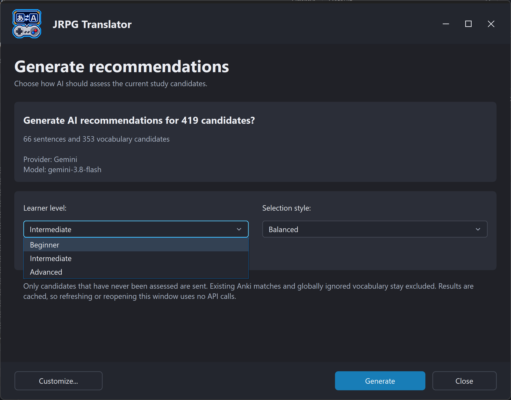

# 11A. Reviewing sentence and vocabulary recommendations

[← Study Library](11-study-library.md) · [Contents](README.md) · [Next: Anki →](11b-anki.md)

## Candidates are not yet flashcards

The candidate review window collects material that might be useful for Anki. Its **Sentences** and **Vocabulary** views help you choose what is worth studying.

Opening or refreshing this window builds/reads the candidate list locally. It does not automatically ask an AI to assess everything, and it does not automatically add cards to Anki.

Open **Anki... → Review Anki candidates...** in the Study Library.

*Figure S25. The selected sentence has a recommendation score and an explanation of the assessment. Add to Anki, Open in Reader, and Finish review are separate actions.*

## Choose what to review

The review scope includes:

| Scope | Use |
| --- | --- |
| New since last review | Focus on material collected after the review checkpoint |
| All backlog | Revisit older material as well |
| Ignored vocabulary | Inspect vocabulary intentionally excluded from normal review and restore it if wanted |

Use the AI-assessment filter to distinguish recommended, not recommended, and not-yet-assessed material. **Not assessed** means no applicable assessment is available; it does not mean the material was judged unhelpful.

Known Anki matches and ignored vocabulary are excluded from relevant assessment/add flows. Matching has limits: it is based on normalized Japanese text and the configured Anki scope, not a semantic understanding that two different sentences teach the same thing.

## Generate recommendations

1. Choose the Library/context and review scope.
2. Open the generation action.
3. Check the displayed candidate counts, provider, and model.
4. Choose **Learner level**: Beginner, Intermediate, or Advanced.
5. Choose **Selection style**: Selective, Balanced, or Generous.
6. Customize the criteria if needed.
7. Confirm **Generate**.

*Figure S26a. Check the assessment scope, choose a learner level and selection style, then explicitly select Generate. Customize opens the additional learning criteria.*

Generation uses the **Explanation provider/model**. It is an AI request and can consume provider usage. The confirmation identifies what will be assessed.

Normal generation targets candidates not yet assessed under the applicable configuration. **Regenerate** replaces assessments for the targeted candidates; use it intentionally if you change your criteria or disagree with earlier results.

Results are cached. Reopening or refreshing the review window does not by itself regenerate the ratings. Changes to content, model, or preferences can make an old assessment inapplicable and require another assessment.

## Customize the recommendation criteria

The customization dialog lets you emphasize areas such as:

- Reusable vocabulary
- Grammar
- Natural phrasing
- Reading practice

Keep at least one focus area enabled. Set the learner level honestly: an easy sentence can be a good beginner card even if it would add little for an advanced learner.

You can supply additional criteria, such as preferring everyday dialogue or avoiding very game-specific names. Selection style affects how broadly the model recommends material; it does not change how many cards Anki will add automatically, because adding remains a separate action.

> **Screenshot S26b — Customized recommendation criteria (to be added).** Show the focus areas and optional custom instructions inside Customize.

If you edit the custom recommendation prompt, follow its **Save draft** and **Apply preferences** steps. Saving a draft is not the same as applying it and running a new assessment.

The output-format/schema instructions are protected so the app can read the response. The full prompt view is for inspection; customization is intended for learning criteria, not removing the required machine-readable structure.

## Interpret the results

Read the recommendation reason as well as the rating. Consider whether the material:

- Is understandable in context.
- Has a useful, accurate explanation.
- Matches your current learning goals.
- Is short enough to review without becoming a chore.
- Duplicates something already in your deck.

AI assessment is a prioritization aid, not a guarantee that vocabulary extraction or grammar analysis is correct. Check the original explanation and screenshot when a candidate looks suspicious.

## Ignore vocabulary or finish a review

Ignoring a vocabulary item is useful for words you already know or do not want to study. The ignored-vocabulary preference is **shared across Libraries**, so do not use it as if it only hides an item in one game. Use the Ignored vocabulary scope to restore an item later.

**Finish review** records the review checkpoint used by **New since last review**. It does not add cards, erase the Library, or mean that every candidate was processed successfully. Use **All backlog** to return to older skipped material.

## A suggested workflow

Review new candidates, generate recommendations if useful, read the reasons, and open promising entries. Add only the ones you want after checking the card preview. Finish the review when the session is complete.

For manual selection without AI ranking, simply review the candidates yourself and use the same explicit card-creation process described next.
