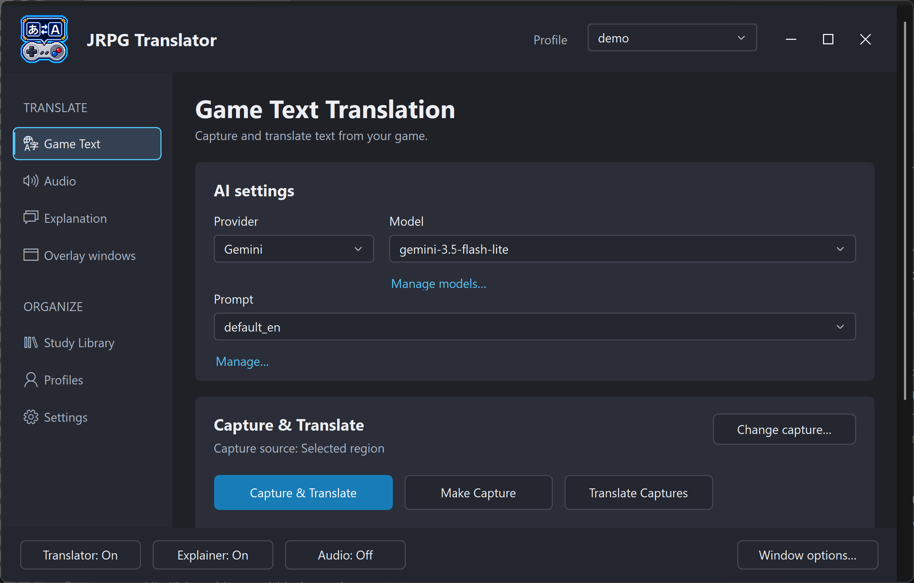

# Screenshot checklist

[Manual contents](README.md)

The first two batches illustrate **26 of 28 topics: 18 complete, 8 partial, and 2 awaiting a publishable image**. Partial topics have a published image plus a numbered placeholder for the missing companion view. S18 is held for complete path redaction; S10 has not yet been supplied. No nonexistent image is embedded.

S05 is an annotated overview based on the supplied S07 screenshot; the unannotated original is retained. All other published images are the supplied screenshots, unmodified. Click an image filename below to inspect the full-resolution asset. Screenshot coverage last updated: 20 September 2026.

## Capture guidelines

- Use the matching v0.9.9 testing build and current interface. Do not reuse an older screenshot just because the page has the same name.
- Prefer actual application screenshots over mockups. Keep the focus border where it helps explain navigation.
- Use consistent Windows scaling and window sizes. Capture full-screen examples at 1280×720 to demonstrate the intended small-screen layout.
- Make text readable on GitHub and in a later PDF. Use an overview plus a close crop when one image would make labels too small.
- Remove API keys, account identifiers, personal paths, private game/library names, and unrelated desktop content. Check masked key fields too before publication.
- Use short, consistent, non-private sample study content. Only include game artwork/screenshots you are entitled to publish.
- Keep the selected control and visible values consistent with the caption and nearby instructions.
- Save images under `docs/manual/images/`. Filenames below are reserved suggestions, not existing assets.
- Prefer PNG for interface text. Optimize image size without making labels blurry.

## Required shots

| ID | Status | Chapter / subject | Image filename | Coverage / next shot |
| --- | --- | --- | --- | --- |
| S01 | Complete | [Overall workflow](01-introduction.md) | [overall-workflow.png](images/overall-workflow.png) | Added: game, transcript/translation, and Explainer together. |
| S02 | Complete | [Extracted application](02-setup.md) | [extracted-application.png](images/extracted-application.png) | Added: extracted portable files with no personal parent path. |
| S03 | Complete | [API-key settings](02-setup.md) | [api-key-settings.png](images/api-key-settings.png) | Added: in-app key storage with both credentials masked. |
| S04 | Complete | [First capture and result](02-setup.md) | [first-capture-and-result.png](images/first-capture-and-result.png) | Added: original game dialogue and matching translated output; no region-selection outline. |
| S05 | Complete | [Desktop orientation](03-interface-and-controller.md) | [desktop-orientation.png](images/desktop-orientation.png) | Added: four numbered labels identifying sidebar, header Profile selector, page content, and footer. Original preserved as S07. |
| S06 | Partial | [Controls and bindings](03-interface-and-controller.md) | [controls-and-bindings.png](images/controls-and-bindings.png) | S06a added: action bindings. **Still needed S06b:** lower controller options, direct-action/D-pad switches, and detection status. |
| S07 | Partial | [Game Text page](04-game-text-translation.md) | [game-text-page.png](images/game-text-page.png) | S07a added: AI settings and capture actions. **Still needed S07b:** Formatting and Startup & advanced capture, including image-size limit. |
| S08 | Complete | [Capture choices](04-game-text-translation.md) | [capture-choices.png](images/capture-choices.png) | Added: desktop Capture region / Capture window menu. Its size limit lives in advanced capture settings, not in this popup. |
| S09 | Partial | [Audio setup and input check](05-audio-translation.md) | [audio-setup-and-input-check.png](images/audio-setup-and-input-check.png) | S09a added: AI/language and playback-device selection. **Still needed S09b:** completed input-check result and Start audio translation. |
| S10 | Pending | [Explanation settings](06-explanation.md) | `explanation-settings.png` | Show the AI choices, Explain latest text, and saving options. |
| S11 | Complete | [Explainer output](06-explanation.md) | [explainer-output.png](images/explainer-output.png) | Added: Japanese-source analysis beside the transcript and translation. |
| S12 | Complete | [Overlay appearance and typography](07-overlay-windows.md) | [overlay-appearance-and-typography.png](images/overlay-appearance-and-typography.png) | Added: Translator appearance, speaker color, font, size, and bold. |
| S13 | Complete | [Overlay positioning](07-overlay-windows.md) | [overlay-positioning.png](images/overlay-positioning.png) | Added: real positioning mode with move, resize, save, and cancel instructions. |
| S14 | Partial | [Terminology overview](08-terminology-overrides.md) | [terminology-overview.png](images/terminology-overview.png) | S14a added: enable switch and local-correction introduction. **Still needed S14b:** both glossary selectors and management controls. |
| S15 | Complete | [Glossary entries](08-terminology-overrides.md) | [glossary-entry-editor.png](images/glossary-entry-editor.png) | Added: local-corrections manager with translation-output/replacement columns and Add/Edit entry controls. |
| S16 | Complete | [Profile management](09-profiles.md) | [profile-management.png](images/profile-management.png) | Added: selection, Apply profile, Save current, New/Delete profile, and Startup overlays choice. |
| S17 | Complete | [Per-game plugin setup](10-launchbox-and-big-box.md) | [per-game-plugin-setup.png](images/per-game-plugin-setup.png) | Added: both app icons, enable controls, separate Profile selections, readiness, and Save/Cancel. |
| S18 | Pending | [Expanded application locations](10-launchbox-and-big-box.md) | `expanded-application-locations.png` | Supplied but **not published**: the JoyToKey profiles path still exposes a personal account name. Supply a fully redacted replacement. |
| S19 | Complete | [Full-screen dashboard](10-launchbox-and-big-box.md) | [full-screen-dashboard.png](images/full-screen-dashboard.png) | Added: running game, Home, contextual help, focused tile, and navigation hints. Original is 3840×2160; a separate 1280×720 capture remains useful for small-screen documentation. |
| S20 | Complete | [Study Library overview](11-study-library.md) | [study-library-overview.png](images/study-library-overview.png) | Added: Library selection, search, table, selected source, version controls, and screenshot preview. |
| S21 | Partial | [Library dropdown and management](11-study-library.md) | [library-dropdown-and-management.png](images/library-dropdown-and-management.png) | S21a added: separated Manage Study Libraries command. **Still needed S21b:** Library manager with create, rename, archive, and restore options. |
| S22 | Partial | [Table filters and columns](11-study-library.md) | [table-filters-and-columns.png](images/table-filters-and-columns.png) | S22a added: filtered result and a cropped Filters dialog. **Still needed S22b:** complete dialog/action buttons and Columns settings or a table including Chapter, Key grammar, and Versions. |
| S23 | Partial | [Metadata and current chapter](11-study-library.md) | [metadata-and-current-chapter.png](images/metadata-and-current-chapter.png) | S23a added: future-entry Current chapter dialog. **Still needed S23b:** Edit details for an existing saved entry. |
| S24 | Complete | [Study Reader](11-study-library.md) | [study-reader.png](images/study-reader.png) | Added: Japanese source, translation/analysis, version and section navigation, and screenshot context. |
| S25 | Complete | [Candidate review](11a-study-recommendations.md) | [candidate-review.png](images/candidate-review.png) | Added: Sentences/Vocabulary selectors, review scope, ratings/reason, and explicit regeneration/add/review actions. |
| S26 | Partial | [Recommendation preferences](11a-study-recommendations.md) | [recommendation-preferences.png](images/recommendation-preferences.png) | S26a added: generation confirmation with candidate counts, level/style, and Customize. **Still needed S26b:** customization focus areas and optional instructions. |
| S27 | Complete | [Anki connection and mapping](11b-anki.md) | [anki-connection-and-mapping.png](images/anki-connection-and-mapping.png) | Added: successful connection, deck/note type, and Japanese/Explanation field mapping. |
| S28 | Complete | [Card preview and explicit add](11b-anki.md) | [card-preview-and-explicit-add.png](images/card-preview-and-explicit-add.png) | Added: front/back review, destination deck, optional screenshot, and explicit Add to Anki. |

## Replace a placeholder

1. Capture and inspect the real application state.
2. Save the image with the corresponding proposed filename.
3. Replace that chapter's placeholder blockquote with an image and short caption.
4. Use meaningful alt text describing what the screenshot teaches.
5. Keep the ID in the caption/checklist so later updates can identify the shot.
6. Update the topic's Complete / Partial / Pending status and the counts above. Keep a topic Partial until its required companion shots are present.
7. Check the rendered chapter on GitHub and at the expected PDF reading size.

For example, once the actual image exists:

```markdown


*Figure S07. Game Text settings and the capture actions.*
```

This code example intentionally does not render a missing image. Add the asset first, then use the same pattern in its chapter.

If one placeholder needs two images, append `-a` and `-b` to its filenames and use captions S07a/S07b, for example. Do not renumber the entire manual.
